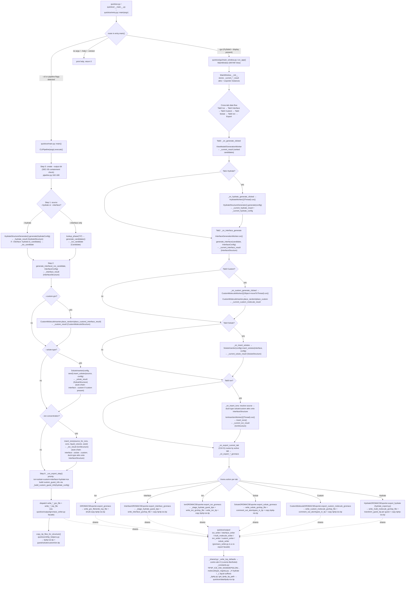

# GROMACS Export Flow Trace — quickice (CLI + GUI)

**Analysis Date:** 2026-07-23
**Mode:** READ-ONLY, bias-free. Traced by reading actual source only. No prior `.planning/code_analysis/` or `.planning/codebase/` files were consulted. No code was executed, no `pytest`, no `gmx`. Nothing was modified.

**Scope:** The complete call + data-flow chain that ends in a successful GROMACS export (`.gro` + `.top` + `.itp` files), for BOTH the CLI path (`entry.py → main.py → CLIPipeline.execute()`) and the GUI path (`entry.py → main_window.py` MVVM).

---

## 1. High-Level Flowchart

Both paths share the same physics engine in `quickice/structure_generation/` and the same writers in `quickice/output/`. They diverge only in orchestration and in how the user triggers export.



---

## 2. CLI Path — Step-by-Step Trace

### 2.0 Entry routing

**`quickice/entry.py::main(argv: list[str] | None = None) -> int`** (lines 105–201)
- Pre-parses `--cli`/`--gui` with a minimal `argparse.ArgumentParser` (`parse_known_args`).
- Routing priority: no-args → help; `--help`/`-h` → argparse help (exit 0); `--version`/`-V` → argparse version; `--gui` → check `_is_pyside6_available()` (uses `importlib.util.find_spec`, never imports) + `_has_display()` then `from quickice.gui.main_window import run_app; run_app()`; `--cli` → strip `--cli`/`--gui`, set `sys.argv`, `from quickice.main import main as cli_main; return cli_main()`; pipeline flags detected via `_has_pipeline_flags(argv)` → same CLI dispatch; else help.
- `quickice/quickice.py` (lines 1–10) and `quickice/__main__.py` (lines 1–5) both simply call `from quickice.entry import main; sys.exit(main())`.

**`quickice/main.py::main() -> int`** (lines 23–195)
- `args = get_arguments()` (`quickice/cli/parser.py::get_arguments`).
- Detects pipeline flags: `args.interface or args.hydrate or args.custom_gro or args.solute_type or args.ion_concentration`.
- If pipeline flags present → `pipeline = CLIPipeline(args); return pipeline.execute()`.
- Else **ice-only backward-compat workflow** (lines 48–182): `lookup_phase(T,P)` → `generate_candidates(phase_info, nmolecules, n_candidates=10)` → `rank_candidates(candidates)` → if `args.gromacs`: loop `ranking_result.ranked_candidates`, `write_gro_file(candidate, gro_filepath)` per candidate, then once `write_top_file(first_candidate, top_filepath)` and `shutil.copy(get_tip4p_itp_path(), "tip4p-ice.itp")`; then `output_ranked_candidates(...)` for PDB + phase diagram.

### 2.1 `CLIPipeline` (quickice/cli/pipeline.py)

**`class CLIPipeline`** (lines 133–997). Constructor stores `args` and initializes `_interface_result`, `_hydrate_result`, `_custom_result`, `_solute_result`, `_ion_result`, `_ice_candidate`, `_output_dir` all to `None`.

**`execute() -> int`** (lines 154–226) — ordered, fail-fast:
1. **Step 0** (162–180): `output_path = Path(args.output).resolve()`; SEC-05 containment check `output_path.is_relative_to(cwd)` raises `ValueError` if outside CWD; `output_path.mkdir(parents=True, exist_ok=True)`; store `self._output_dir`. Caught `except OSError` → return 1.
2. **Step 0b** (182–193): if `args.no_overwrite` and output dir non-empty → log + return 0.
3. **Step 1 source** (196–199): if `args.interface or args.hydrate` → `_run_source_step()`.
4. **Step 2 interface** (202–205): if `args.interface` → `_run_interface_step()`.
5. **Step 3 custom** (208–211): if `args.custom_gro` → `_run_custom_step()`.
6. **Step 4 solute** (214–217): if `args.solute_type` → `_run_solute_step()`.
7. **Step 5 ion** (220–223): if `args.ion_concentration` → `_run_ion_step()`.
8. **Step 6 export** (226): `return self._run_export_step()`.

#### Step 1 — `_run_source_step() -> int` (lines 330–435)

- **Hydrate branch** (`args.hydrate`, 345–401): lazy-imports `HydrateConfig`, `WATER_ATOMS_PER_MOLECULE`, `HydrateStructureGenerator`. Parses `args.cage_guest` (list of `"KEY=GUEST:OCC"`) via `_parse_cage_guest_args(args, lattice_type)` (lines 59–130) → `dict[str, CageGuestAssignment]` (built-in CH4/THF only on CLI; custom-guest CLI deferred). Builds `HydrateConfig(lattice_type, cage_guest_assignments, guest_type, supercell_xyz, cage_occupancy_small/large, depol_mode)` — `__post_init__` auto-populates built-in guest metadata and synthesizes `cage_guest_assignments` from legacy fields when the dict is empty (`types.py:575–816`). `generator = HydrateStructureGenerator()`; `self._hydrate_result = generator.generate(config)` (returns `HydrateStructure`). If `args.interface` also set: `self._ice_candidate = self._hydrate_result.to_candidate()` (`types.py:1203–1279` — packs water+guest positions, sets `phase_id="hydrate_{lattice}"`, carries `guest_descriptors`/`guest_atom_counts` in metadata). Returns 0.
- **Ice branch** (403–433, when `--interface` without `--hydrate`): `lookup_phase(T,P)`; `generate_candidates(phase_info, nmolecules, n_candidates=1, base_seed=args.seed)` (`generator.py:209`); `self._ice_candidate = gen_result.candidates[0]`.

**Data out:** `self._ice_candidate: Candidate` and/or `self._hydrate_result: HydrateStructure`.

#### Step 2 — `_run_interface_step() -> int` (lines 437–485)

- Lazy-imports `InterfaceConfig`, `generate_interface` (`interface_builder.py:331`), `InterfaceGenerationError`.
- Builds `InterfaceConfig(mode, box_xyz, ice_thickness, water_thickness, pocket_diameter, pocket_shape, seed)` (`types.py:278`).
- `self._interface_result = generate_interface(self._ice_candidate, config)` → routes to `assemble_slab`/`assemble_pocket`/`assemble_piece`. Returns `InterfaceStructure` (`types.py:348`): `positions` (ice→water→guest order), `atom_names`, `cell`, `ice_atom_count`, `water_atom_count`, `ice_nmolecules`, `water_nmolecules`, `mode`, `report`, `guest_atom_count`, `molecule_index`, `guest_nmolecules`, `guest_descriptors`, `guest_atom_counts`.

**Data out:** `self._interface_result: InterfaceStructure`.

#### Step 3 — `_run_custom_step() -> int` (lines 487–627)

- Lazy-imports `CustomMoleculeInserter`, `InsertionError`, `CustomMoleculeConfig`.
- Validates `--custom-gro`/`--custom-itp` (`.gro`/`.itp` extension, SEC-04 path containment).
- `source = self._interface_result` (raises if None).
- **Random mode** (`args.custom_placement == "random"`, 558–591): count from `--custom-count` or computed from `--custom-concentration` via `water_nmolecules * WATER_VOLUME_NM3 * 1e-24 * AVOGADRO` (`AVOGADRO` from `ion_inserter`). `config = CustomMoleculeConfig(gro_path, itp_path, placement_mode="random", molecule_count=count)`; `inserter = CustomMoleculeInserter(config, seed=args.seed)`; `self._custom_result = inserter.place_random(source, count)`.
- **Custom mode** (593–612): `positions, rotations = self._parse_positions_csv(args.custom_positions_file)` (lines 255–324, 6 cols x,y,z,alpha,beta,gamma; SEC-04 + MAX_CSV_ROWS guard). `config = CustomMoleculeConfig(..., placement_mode="custom", positions, rotations)`; `self._custom_result = inserter.place_custom(source, positions, rotations)`.
- `CustomMoleculeInserter.place_random` (`custom_molecule_inserter.py:562`) / `place_custom` (`:860`) both return a **NEW** `CustomMoleculeStructure` (`types.py:1022`) — ice+water+custom combined, with `molecule_index`, `interface_structure` ref, `moleculetype_name`, `gro_path`, `itp_path`, `residue_name`, `molecule_charge`. cKDTree rebuild pattern: `existing_tree` built once from ice+guest non-MW atoms; `buffer_tree = None`, rebuilt per successful placement; main tree rebuilt in batches (`custom_molecule_inserter.py:619–724`).

**Data out:** `self._custom_result: CustomMoleculeStructure`.

#### Step 4 — `_run_solute_step() -> int` (lines 629–698)

- Lazy-imports `SoluteInserter`, `SoluteConfig`.
- **Auto-chain** (659–664): if `args.solute_source == 'interface'` (default) and `self._custom_result is not None` → upgrade `source_name` to `'custom'` so custom molecule attrs are preserved.
- `source = self._get_source_structure(source_name)` (lines 228–253, maps 'interface'/'custom'/'solute').
- `config = SoluteConfig(concentration_molar=args.solute_concentration, solute_type=args.solute_type)` (`types.py:892`, validates solute_type ∈ {CH4,THF}).
- `inserter = SoluteInserter(config, seed=args.seed)` (FIX #7: seed passed); `self._solute_result = inserter.insert_solutes(source, config)` (`solute_inserter.py:732`).
- `insert_solutes` computes `liquid_volume_nm3 = water_nmolecules * WATER_VOLUME_NM3`, `n_molecules = calculate_molecule_count(conc, vol)`, loads solute template (`_generate_ch4_coordinates`/`_generate_thf_coordinates`), builds `existing_tree` (cKDTree, excludes water), places molecules with `buffer_tree` rebuild-after-success pattern (`solute_inserter.py:907–984`), removes overlapping water (`_remove_overlapping_water` returns new interface), registers `CH4_L`/`THF_L` via `self.registry.register_liquid_solute(...)`. Returns **NEW** `SoluteStructure` (`types.py:921`) carrying `interface_structure`, `ice_nmolecules`, `water_nmolecules`, custom-molecule attrs propagated from source.

**Data out:** `self._solute_result: SoluteStructure`.

#### Step 5 — `_run_ion_step() -> int` (lines 700–857)

- Lazy-imports `insert_ions` (`ion_inserter.py:741`), `WATER_ATOMS_PER_MOLECULE`.
- **Auto-chain** (741–753): if `args.ion_source == 'interface'` (default), upgrade to `'solute'` if `_solute_result` set, else `'custom'` if `_custom_result` set.
- **Source resolution + duck-typing onto InterfaceStructure** (755–835):
  - `'interface'` → `source_for_ions = self._interface_result`.
  - `'custom'` → `interface = source.interface_structure`; **FIX #4 offset** = `ice_atom_count + water_atom_count + guest_atom_count`; set `interface.custom_molecule_positions = source.positions[offset:]`, `custom_molecule_atom_names`, `custom_molecule_count`, `custom_molecule_atom_count`, `custom_molecule_moleculetype`, `custom_gro_path`, `custom_itp_path`.
  - `'solute'` → `interface = source.interface_structure`; set `interface.solute_type`, `solute_positions`, `solute_atom_names`, `solute_n_molecules`, `solute_molecule_indices`, `solute_registry`; if `source.custom_molecule_count > 0`, also propagate all custom-molecule attrs.
  - This duck-typing on `InterfaceStructure` is an accepted design decision (CP-01) — NOT a bug.
- `liquid_volume = source_for_ions.water_nmolecules * WATER_VOLUME_NM3`.
- `self._ion_result = insert_ions(source_for_ions, concentration_molar=args.ion_concentration, liquid_volume_nm3=liquid_volume, seed=args.seed)`.
- `insert_ions` (lines 741–774) builds `IonConfig`, `IonInserter(config, seed)`, `ion_pairs = calculate_ion_pairs(conc, vol)` (N = C_M × V_L × NA, `ion_inserter.py:231`), returns `inserter.replace_water_with_ions(structure, ion_pairs)`.
- `replace_water_with_ions` (lines 266–738): builds `molecule_index` from structure metadata (`_build_molecule_index_from_structure`, handles mixed-guest per-molecule walk via `iter_guest_molecules` for Phase 45-15), builds `existing_atoms_tree = cKDTree(ice+guest non-MW atoms)`, pre-allocates `ion_positions_arr`, `ion_tree = None` rebuilt **only after successful placement** in batches of `_ION_BATCH_SIZE=8` (lines 520–575), alternates Na/Cl by `placed_count` (CRIT-02 parity by placement order), enforces charge neutrality by trimming excess. Returns **NEW** `IonStructure` (`types.py:838`) carrying `na_count`, `cl_count`, `molecule_index`, and propagated guest/solute/custom attrs via `getattr` (lines 661–714).

**Data out:** `self._ion_result: IonStructure`.

#### Step 6 — `_run_export_step() -> int` (lines 859–996)

- Lazy-imports all `write_*_gro_file`/`write_*_top_file` from `quickice.output.gromacs_writer` (the facade) and `copy_itp_files_for_structure` from `quickice.cli.itp_helpers`.
- **Priority selection** (888–900): `ion > solute > custom > interface > hydrate > ice` → `(structure, step_name)`. If None → return 1.
- `gro_path = output_dir / f"{step_name}.gro"`; `top_path = output_dir / f"{step_name}.top"`.
- `hydrate_config = getattr(self._hydrate_result, "config", None)`; `cgi = _build_custom_guest_info(hydrate_config)` (`quickice/output/guest_info.py:10`).
- **Writer dispatch by step_name** (921–981):
  - `"ice"` → `write_gro_file(structure, gro_path)` + `write_top_file(structure, top_path)`.
  - `"hydrate"` → wrap `HydrateStructure` into an `InterfaceStructure`-compatible wrapper (928–960): `water_atom_count = water_count * WATER_ATOMS_PER_MOLECULE`, `guest_atom_count = len(positions) - water_atom_count`, validated by `_validate_hydrate_atom_counts(...)` (lines 33–56, replaces a stripped `assert`, CRIT-04); `custom_guest_info = _build_custom_guest_info(hydrate.config)`; `write_interface_gro_file(wrapper, gro_path, custom_guest_info=...)` + `write_interface_top_file(wrapper, top_path, custom_guest_info=...)`.
  - `"interface"` → `write_interface_gro_file(structure, gro_path, custom_guest_info=cgi)` + `write_interface_top_file(structure, top_path, custom_guest_info=cgi)`.
  - `"custom"` → `write_custom_molecule_gro_file` + `write_custom_molecule_top_file` (with `cgi`).
  - `"solute"` → `write_solute_gro_file` + `write_solute_top_file` (with `cgi`).
  - `"ion"` → `write_ion_gro_file` + `write_ion_top_file` (with `cgi`).
- `itp_files = copy_itp_files_for_structure(self._output_dir, structure, step_name, hydrate_config=hydrate_config)` (`quickice/cli/itp_helpers.py:282`) — always copies `tip4p-ice.itp`, then per step copies guest/solute/custom ITPs (see §5).
- Caught `except (OSError, ValueError)` → return 1. Returns 0 on success.

---

## 3. GUI Path — Step-by-Step Trace

### 3.0 Entry

`entry.main()` with `--gui` → checks `_is_pyside6_available()` and `_has_display()`, then `from quickice.gui.main_window import run_app; run_app()` (`entry.py:176–178`).

### 3.1 `MainWindow` (`quickice/gui/main_window.py`)

MVVM **View** (`class MainWindow(QMainWindow)`, line 123). State attributes (lines 152–183):
- `self._current_result` — ranked ice candidates (from Tab 0).
- `self._current_T`, `self._current_P`.
- `self._current_interface_result: InterfaceStructure | None`.
- `self._current_hydrate_config: HydrateConfig | None`, `self._current_hydrate_result: HydrateStructure | None`.
- `self._current_solute_result`, `self._current_custom_molecule_result`, `self._current_ion_result`.
- Exporter instances (lines 145–168): `PDBExporter`, `DiagramExporter`, `ViewportExporter`, `GROMACSExporter`, `InterfaceGROMACSExporter`, `IonGROMACSExporter`, `HydrateGROMACSExporter` (in `hydrate_export.py`), `SoluteGROMACSExporter`, `CustomMoleculeGROMACSExporter` — all from `quickice.gui.export` (line 31) plus `HydrateGROMACSExporter` from `hydrate_export.py`.

### 3.2 Cross-tab generation flow

**Tab 0 — Ice** (`_on_generate_clicked`, line 501): ViewModel `start_generation` → `GenerationWorker(QObject, moveToThread)` (`quickice/gui/workers.py:26`) → `_on_generation_complete`/`_on_candidates_ready` → `self._current_result = ranking_result`.

**Tab 1 — Hydrate** (`_on_hydrate_generate_clicked`, lines 820–842): `config = self.hydrate_panel.get_configuration()`; `self._current_hydrate_config = config`; `self._hydrate_worker = HydrateWorker(config)`; connect signals; `start()`.
- `HydrateWorker(QThread)` (`quickice/gui/hydrate_worker.py:15`, direct `QThread` subclass per AGENTS.md — NOT QObject+moveToThread). `run()` (lines 50–114) lazy-imports `HydrateStructureGenerator`, `generator.generate(self._config)` → emits `generation_complete(HydrateStructure)`.
- `_on_hydrate_generation_complete` (lines 852–877): `self._current_hydrate_result = result`.

**Tab 2 — Interface** (`_on_interface_generate`, lines 637–678): `InterfaceConfig.from_dict(self.interface_panel.get_configuration())`; `self._viewmodel.start_interface_generation(candidate, config)`.
- ViewModel → `InterfaceGenerationWorker(QObject, moveToThread)` (`quickice/gui/workers.py:146`). `run()` (lines 185–222) lazy-imports `generate_interface`, calls `generate_interface(self._candidate, self._config)` → emits `InterfaceGenerationResult`.
- `_on_interface_generation_complete` (lines 688–734): `self._current_interface_result = result`; pushes `liquid_vol = result.water_nmolecules * WATER_VOLUME_NM3` to `ion_panel.set_liquid_volume` and `solute_panel.set_liquid_volume`; passes interface to `custom_molecule_panel.set_interface_structure`.
- **Hydrate→Interface** variant (`_on_interface_hydrate_generate`, line 750): uses `self._current_hydrate_result.to_candidate()` as the seed candidate.

**Tab 3 — Custom** (`_on_custom_generate_clicked`, lines 1245–1322): requires `self._current_interface_result`; `config = self.custom_molecule_panel.get_configuration()`; `self._custom_worker = CustomMoleculeWorker(config, self._current_interface_result, gro_path, itp_path)`; `moveToThread(self._custom_worker_thread)`; `start()`.
- `CustomMoleculeWorker(QObject)` (`quickice/gui/custom_molecule_worker.py:18`). `run()` (lines 67–131) parses `gro_path` via `parse_gro_file`, `inserter = CustomMoleculeInserter(self._config)`, calls `place_random(structure, count)` or `place_custom(structure, positions, rotations)` → emits `finished(CustomMoleculeStructure)`.
- `_on_custom_finished` (lines 1325–): `self._current_custom_molecule_result = result`; passes to `solute_panel.set_custom_molecule_structure` (Tab 4 chaining).

**Tab 4 — Solute** (`_on_insert_solutes`, lines 1136–1242): `current_source = self.solute_panel.get_current_source()` (Interface or Custom Molecule). For Custom: `interface = custom_structure` (full `CustomMoleculeStructure` passed so inserter preserves custom info). `config = self.solute_panel.get_configuration()`; `inserter = SoluteInserter(config)` (no explicit seed on GUI); `solute_structure = inserter.insert_solutes(interface, config)` — **synchronous on the main GUI thread**. `self._current_solute_result = solute_structure`; `self.ion_panel.set_solute_structure(solute_structure)` (Tab 5 chaining).

**Tab 5 — Ion** (`_on_insert_ions`, lines 904–1035): `current_source = self.ion_panel.get_current_source()` (Interface / Solute / Custom Molecule). Source resolution + duck-typing (mirrors CLI `_run_ion_step`):
- Solute source (928–955): `interface = solute_structure.interface_structure`; set `interface.solute_type`, `solute_positions`, `solute_atom_names`, `solute_n_molecules`, `solute_molecule_indices`, `solute_registry`.
- Custom source (961–988): `interface = custom_structure.interface_structure`; `interface.custom_molecule_positions = custom_structure.positions[ice_atom_count + water_atom_count + guest_atom_count:]`, `custom_molecule_atom_names`, `custom_molecule_count`, `custom_molecule_atom_count`, `custom_molecule_moleculetype`, `custom_gro_path`, `custom_itp_path`.
- Validates concentration (rejects None/NaN/Inf/<=0, SAFE-07). `volume_arg = None if liquid_volume <= 0 else liquid_volume`. Stashes `self._ion_pending_interface`, `self._ion_pending_source`.
- `self._ion_worker = IonInsertionWorker(interface, concentration, volume_arg)` (lines 49–120, `QThread` subclass mirroring `HydrateWorker`); `run()` lazy-imports `insert_ions` and calls `insert_ions(self._interface, self._concentration, self._volume_arg)` → emits `insertion_complete(IonStructure)`.
- `_on_ion_insertion_complete` (lines 1045–): `self._current_ion_result = ion_structure`.

### 3.3 GUI Export dispatch

`_on_export_current_tab` (lines 1710–1744, unified Ctrl+S) routes by `self.tab_widget.currentIndex()` (`TabIndex` in `quickice/gui/constants.py`) to the matching `_on_export_*_gromacs` slot. Each slot checks the relevant `_current_*_result` is non-None, then delegates to the exporter.

| Tab | Handler | Exporter class (file) | Writer calls |
|-----|---------|----------------------|--------------|
| Ice | `_on_export_gromacs` (1747) | `GROMACSExporter` (`export.py:871`) | `write_gro_file` + `write_top_file` + `shutil.copy(get_tip4p_itp_path(), {stem}.itp)` |
| Hydrate | `_on_export_hydrate_gromacs` (1840) | `HydrateGROMACSExporter` (`hydrate_export.py:78`) | `write_multi_molecule_gro_file` + `write_multi_molecule_top_file` + per-guest `transform_guest_itp` + `shutil.copy(tip4p_itp, "tip4p-ice.itp")` |
| Interface | `_on_export_interface_gromacs` (1788) | `InterfaceGROMACSExporter` (`export.py:1010`) | `_stage_hydrate_guest_itps` + `write_interface_gro_file` + `write_interface_top_file` + `shutil.copy("tip4p-ice.itp")` |
| Custom | `_on_export_custom_molecule_gromacs` (1999) | `CustomMoleculeGROMACSExporter` (`export.py:263`) | `write_custom_molecule_gro_file` + `write_custom_molecule_top_file` + `comment_out_atomtypes_in_itp` + `shutil.copy("tip4p-ice.itp")` |
| Solute | `_on_export_solute_gromacs` (1940) | `SoluteGROMACSExporter` (`export.py:106`) | `write_solute_gro_file` + `write_solute_top_file` + `comment_out_atomtypes_in_itp` + `shutil.copy("tip4p-ice.itp")` |
| Ion | `_on_export_ion_gromacs` (1876) | `IonGROMACSExporter` (`export.py:417`) | `_stage_hydrate_guest_itps` + `write_ion_gro_file` + `write_ion_top_file` + `write_ion_itp` + `comment_out_atomtypes_in_itp` + `shutil.copy("tip4p-ice.itp")` |

All GUI exporters (`export.py`): prompt `QFileDialog.getSaveFileName` with a default absolute path from `_build_default_path(parent, filename)` (`export.py:68`); remember dir via `_remember_export_dir` (`export.py:93`); ensure `.gro` suffix; derive `top_path = path.with_name(path.stem + '.top')`; `except Exception` → `QMessageBox.critical`.

**Hydrate exporter specifics** (`hydrate_export.py:97–369`): builds a fresh `MoleculetypeRegistry()`; iterates unique guest `mol_type`s in `structure.molecule_index`; built-in guests → `registry.register_hydrate_guest(mol_type.upper())` (→ `CH4_H`/`THF_H`) + bundled `{guest_type}_hydrate.itp`; custom guests → `custom_guest_info` list with `residue_name="{guest_residue_name}_H"` and `itp_path` from `config.cage_guest_assignments`. Calls `write_multi_molecule_gro_file(positions, molecule_index, cell, path, title, atom_names, registry, custom_guest_info)` and `write_multi_molecule_top_file(molecule_index, top_path, title, itp_files, registry, custom_guest_info)`. Copies `tip4p-ice.itp`; for each guest, `transform_guest_itp(content, guest_name, suffix="_H")` (idempotent on pre-transformed built-in ITPs).

**Interface/Ion exporter specifics** (`export.py:1010`/`417`): call `from quickice.output.guest_info import _stage_hydrate_guest_itps` (`guest_info.py:179`) which is **config-driven** (Option A) — builds `custom_guest_info` from `hydrate_config`, transforms+writes each custom guest ITP with `_H` suffix, and copies bundled `{guest_type}_hydrate.itp` for built-ins. The returned `custom_guest_info` is threaded to both the `.gro` and `.top` writers.

---

## 4. The Export Writers (`quickice/output/`)

`quickice/output/gromacs_writer.py` (87 lines) is a **re-export facade**. It binds names from `quickice.output._shared` (constants/helpers, `gromacs_writer.py:32–60`), `quickice.output._gro_format` (GRO line formatters, `:68–72`), and the six per-structure writers (`:78–86`):

| Writer module | `.gro` function | `.top` function | Used for step |
|---------------|-----------------|-----------------|--------------|
| `ice_writer.py` | `write_gro_file(candidate, filepath)` (`:34`) | `write_top_file(candidate, filepath)` (`:138`) | ice |
| `interface_writer.py` | `write_interface_gro_file(iface, filepath, custom_guest_info=None)` (`:50`) | `write_interface_top_file(iface, filepath, custom_guest_info=None)` (`:354`) | interface, hydrate (via wrapper) |
| `multi_molecule_writer.py` | `write_multi_molecule_gro_file(positions, molecule_index, cell, filepath, title, atom_names, registry, custom_guest_info)` (`:76`) | `write_multi_molecule_top_file(molecule_index, filepath, title, itp_files, registry, custom_guest_info)` (`:261`) | hydrate (GUI) |
| `custom_writer.py` | `write_custom_molecule_gro_file(custom_structure, filepath, custom_guest_info=None)` (`:78`) | `write_custom_molecule_top_file(...)` (`:339`) | custom |
| `solute_writer.py` | `write_solute_gro_file(solute_structure, filepath, custom_guest_info=None)` (`:80`) | `write_solute_top_file(...)` (`:482`) | solute |
| `ion_writer.py` | `write_ion_gro_file(ion_structure, filepath, custom_guest_info=None)` (`:77`) | `write_ion_top_file(ion_structure, filepath, custom_guest_info=None)` (`:491`) | ion |

### 4.1 `.gro` writing pattern
Each `.gro` writer: builds a `molecule_index` (or uses the structure's), wraps molecules into the box via `wrap_molecules_into_box` (`_pbc.py:62`), computes MW virtual sites via `compute_mw_position(o, h1, h2)` (`_tip4p.py:33`, `MW = O + α*(H1−O) + α*(H2−O)`, `α=TIP4P_ICE_ALPHA=0.13458335`), formats atoms with `_gro_format.py` helpers (`_format_sol_ice_molecule`, `_format_sol_water_molecule`, `_format_guest_molecule`, `_format_custom_molecule`, `_format_solute_molecule`, `_format_na_ion`, `_format_cl_ion`), writes header (`_write_gro_header`), and a 9-value triclinic box line (`_write_gro_box_vectors`). Atom/residue numbers wrap at 100000 per GROMACS convention. **Molecule order in `.gro`** (ion writer, `ion_writer.py:84`): SOL (ice+water) → guest → custom → solute → NA → CL. Custom writer (`custom_writer.py:84`) uses a divergent 3-value diagonal box line.

### 4.2 `.top` writing pattern
Each `.top` writer calls `_write_top_defaults(f, ...)` (`_shared.py:65`) which emits the `[ defaults ]` block with **comb-rule=2 (Lorentz-Berthelot)** — the single source of truth:
```
1               2               yes             0.5     0.8333
```
Three byte-identity variants exist (Format A: `write_top_file`/`write_interface_top_file` with `; Defaults compatible with the Amber forcefield` header; Format B: `write_multi_molecule_top_file` no header, compact comment; Format C: `write_ion_top_file`/`write_custom_molecule_top_file`/`write_solute_top_file` no header, aligned comment). The data line is identical in all three.

- **`write_top_file` (ice, `ice_writer.py:138`)**: inlines `[atomtypes]` (OW_ice/HW_ice/MW from `WATER_ATOMTYPES`, with `TIP4P_ICE_OW_SIGMA`/`TIP4P_ICE_OW_EPSILON`), `[moleculetype] SOL 2`, `[atoms]`, `[settles]`, `[virtual_sites3]` (with `TIP4P_ICE_ALPHA`), `[exclusions]`, `[system]`, `[molecules] SOL {nmol}`. **No `#include`** — the `.itp` is a standalone reference copy.
- **`write_interface_top_file` (`interface_writer.py:354`)**: `[atomtypes]` (water + GAFF2 guest atomtypes via `_write_atomtypes_block` or `_merge_custom_atomtypes` for custom guests), `#include "tip4p-ice.itp"`, `#include "{guest_type}_hydrate.itp"` (built-in) or `#include "{custom_itp_basename}"` (custom, from `custom_guest_info[i]["itp_path"].name`), `[system]`, `[molecules]` with `SOL {ice+water}` then `{guest_residue_name} {guest_nmolecules}` (`get_hydrate_guest_residue_name(guest_type)` for built-in → `CH4_H`/`THF_H`, or `custom_guest_info[i]["residue_name"]` e.g. `MOL_H`).
- **`write_multi_molecule_top_file` (hydrate, `multi_molecule_writer.py:261`)**: registry-driven `[molecules]` (e.g. `SOL`, `CH4_H`, `THF_H`), `#include` per `itp_files`.
- **`write_ion_top_file` (`ion_writer.py:491`)**: `[molecules]` order SOL → guest → custom → solute → NA → CL; `#include "tip4p-ice.itp"`, guest ITP, custom ITP, `{solute}_liquid.itp`, `#include "ion.itp"`.
- **`write_solute_top_file`/`write_custom_molecule_top_file`**: analogous, with `#include "{solute}_liquid.itp"` and custom molecule ITP respectively.

### 4.3 Moleculetype naming — `MoleculetypeRegistry`
`quickice/structure_generation/moleculetype_registry.py:13`. `_H` suffix for hydrate guests (`register_hydrate_guest`, `:46` → `CH4_H`), `_L` suffix for liquid solutes (`register_liquid_solute`, `:71` → `CH4_L`), unique names for custom molecules (`register_custom_molecule`, `:96` → `MOL`/`MOL_1`...). `RESERVED_NAMES = {SOL, NA, CL, CH4, THF, CO2, H2, CH4_H, CH4_L, THF_H, THF_L}` (`:35`). A module-level singleton `_registry = MoleculetypeRegistry()` lives in `_constants.py:107`. The GUI hydrate exporter builds its own fresh registry per export.

### 4.4 TIP4P-ICE parameter sourcing
All TIP4P-ICE constants live in `quickice/output/_constants.py`:
- `TIP4P_ICE_OW_SIGMA = 3.16680e-1` nm, `TIP4P_ICE_OW_EPSILON = 8.82110e-1` kJ/mol (`:21–22`).
- `TIP4P_ICE_HW_CHARGE = 0.5897`, `TIP4P_ICE_MW_CHARGE = -1.1794`, `TIP4P_ICE_SETTLE_DOH = 0.09572`, `TIP4P_ICE_SETTLE_DHH = 0.15139`, `TIP4P_ICE_ALPHA = 0.13458335` (`:17–30`).
- `WATER_ATOMTYPES`, `GAFF2_ATOMTYPES`, `ION_ATOMTYPES` (Madrid2019; the `[atomtypes]` charge column is 0.0 by GROMACS convention — the real Na+/Cl− charges ±0.85 live in `gromacs_ion_export.py::NA_CHARGE`/`CL_CHARGE`, `:25–26`).
- Reference: Abascal et al. 2005, DOI: 10.1063/1.1931662. Verification source: `quickice/data/tip4p-ice.itp` (e.g. `[atoms]` HW charge 0.5897, MW −1.1794; `[settles]` doh 0.09572, dhh 0.15139).
- `get_tip4p_itp_path()` (`_tip4p.py:17`) resolves `quickice/data/tip4p-ice.itp` (package dir, project-root fallback).

---

## 5. ITP Staging / Copying

### CLI — `copy_itp_files_for_structure` (`quickice/cli/itp_helpers.py:282`)
Always copies `tip4p-ice.itp` first (lines 311–318), then per `step_name`:
- `ice`: nothing more.
- `hydrate`: custom guest → `copy_custom_guest_itp` (`:201`, `transform_guest_itp(..., suffix="_H")`); built-in → `_copy_hydrate_guest_itp` (`:167`, `transform_guest_itp` idempotent on pre-transformed `{guest_type}_hydrate.itp`).
- `interface`/`custom`/`solute`/`ion`: each first stages custom-guest ITPs from `hydrate_config` via `_build_custom_guest_info` (44.1-17 mirror), then copies its own ITPs: custom → `_copy_itp_with_atomtypes_commented` (`:144`, `comment_out_atomtypes_in_itp`); solute → `{solute}_liquid.itp` via `get_solute_liquid_itp_path` (`:43`) with atomtypes commented; ion → `write_ion_itp(output_dir/"ion.itp", na_count, cl_count)` (`gromacs_ion_export.py:87`, Madrid2019); plus guest ITP if `guest_atom_count > 0` (`_detect_guest_type`, `:79`).
- Guest type detection (`_detect_guest_type`, `:79`): inspects `molecule_index` for `mol_type` CH4/THF, else atom-count heuristic (≤5 → ch4, ≥10 → thf); falls back to `interface_structure`.

### GUI
- Ice: `shutil.copy(get_tip4p_itp_path(), {stem}.itp)` (note: named after the `.gro` stem, since the ice `.top` has no `#include`).
- Hydrate: `shutil.copy(tip4p_itp, "tip4p-ice.itp")` + per-guest `transform_guest_itp` (`hydrate_export.py:347–357`).
- Interface/Ion: `_stage_hydrate_guest_itps(path.parent, hydrate_config, structure, guest_atom_count, guest_nmolecules)` (`guest_info.py:179`) returns `(custom_guest_info, itp_files)`; copies `tip4p-ice.itp`; stages built-in `{guest_type}_hydrate.itp` or transforms custom guest ITPs to `{residue_name}_H`.
- Solute/Custom: `comment_out_atomtypes_in_itp` (`_itp.py:142`) on the solute/custom ITP; `shutil.copy("tip4p-ice.itp")`.

### Generated `ion.itp`
`quickice/structure_generation/gromacs_ion_export.py::write_ion_itp` (`:87`) writes `[moleculetype] NA 1` + `[atoms]` (NA charge 0.85, mass 22.9898) and `[moleculetype] CL 1` + `[atoms]` (CL charge −0.85, mass 35.453) — Madrid2019.

---

## 6. Data Structures Flowing Between Steps

All defined in `quickice/structure_generation/types.py` unless noted.

| Structure | Defined | Produced by | Consumed by | Key fields handed forward |
|-----------|--------|-------------|-------------|---------------------------|
| `Candidate` | `types.py:224` | `generate_candidates` (`generator.py:209`), `HydrateStructure.to_candidate()` (`types.py:1203`) | `generate_interface` | `positions`, `atom_names`, `cell`, `nmolecules`, `phase_id`, `seed`, `metadata` (carries `guest_descriptors`, `guest_atom_counts`) |
| `InterfaceConfig` | `types.py:278` | CLI: `args`; GUI: `InterfaceConfig.from_dict` | `generate_interface` | `mode`, `box_xyz`, `ice_thickness`, `water_thickness`, `pocket_diameter/shape`, `seed` |
| `InterfaceStructure` | `types.py:348` | `generate_interface` (`interface_builder.py:331`) | custom/solute/ion inserters, all writers | `positions` (ice→water→guest), `atom_names`, `cell`, `ice_atom_count`, `water_atom_count`, `ice_nmolecules`, `water_nmolecules`, `mode`, `report`, `guest_atom_count`, `molecule_index`, `guest_nmolecules`, `guest_descriptors`, `guest_atom_counts`; **duck-typed runtime attrs**: `solute_type`, `solute_positions`, `solute_atom_names`, `solute_n_molecules`, `solute_molecule_indices`, `solute_registry`, `custom_molecule_count`, `custom_molecule_atom_count`, `custom_molecule_positions`, `custom_molecule_atom_names`, `custom_molecule_moleculetype`, `custom_gro_path`, `custom_itp_path` |
| `HydrateConfig` | `types.py:514` | CLI: `_run_source_step`; GUI: `hydrate_panel.get_configuration` | `HydrateStructureGenerator.generate` | `lattice_type`, `guest_type`, `cage_guest_assignments: dict[str, CageGuestAssignment]` (`types.py:442`), `supercell_xyz`, `depol_mode` |
| `HydrateStructure` | `types.py:1164` | `HydrateStructureGenerator.generate` (`hydrate_generator.py:103`) | `to_candidate()`, hydrate writers | `positions`, `atom_names`, `cell`, `molecule_index`, `config`, `lattice_info`, `report`, `guest_count`, `water_count`, `guest_descriptors` |
| `CustomMoleculeConfig` | `types.py:965` | CLI: `_run_custom_step`; GUI: `custom_molecule_panel.get_configuration` | `CustomMoleculeInserter` | `placement_mode`, `gro_path`, `itp_path`, `molecule_count`/`positions`+`rotations` |
| `CustomMoleculeStructure` | `types.py:1022` | `CustomMoleculeInserter.place_random/place_custom` | solute/ion inserters, custom writers | `positions`, `atom_names`, `cell`, `molecule_index`, `ice_atom_count`, `water_atom_count`, `custom_molecule_atom_count`, `ice_nmolecules`, `water_nmolecules`, `config`, `moleculetype_name`, `gro_path`, `itp_path`, `residue_name`, `custom_molecule_count`, `molecule_charge`, `interface_structure` |
| `SoluteConfig` | `types.py:892` | CLI: `_run_solute_step`; GUI: `solute_panel.get_configuration` | `SoluteInserter.insert_solutes` | `concentration_molar`, `solute_type` ∈ {CH4,THF} |
| `SoluteStructure` | `types.py:921` | `SoluteInserter.insert_solutes` (`solute_inserter.py:732`) | ion inserter, solute writers | `positions`, `atom_names`, `cell`, `solute_type`, `n_molecules`, `molecule_indices`, `registry` (with `CH4_L`/`THF_L`), `interface_structure`, `ice_nmolecules`, `water_nmolecules`, custom-molecule attrs propagated |
| `IonConfig` | `types.py:824` | `insert_ions` (`ion_inserter.py:741`) | `IonInserter` | `concentration_molar` |
| `IonStructure` | `types.py:838` | `IonInserter.replace_water_with_ions` (`ion_inserter.py:266`) | ion writers | `positions`, `atom_names`, `cell`, `molecule_index`, `na_count`, `cl_count`, `report`, `guest_nmolecules`, `guest_atom_count`, solute attrs, custom attrs |
| `MoleculeIndex` | `types.py:63` | inserters, `generate_interface` | all writers, cKDTree builders | `start_idx`, `count`, `mol_type` ∈ {ice, water, na, cl, ch4, thf, guest, custom} |
| `MoleculetypeRegistry` | `moleculetype_registry.py:13` | `SoluteInserter.__init__`, GUI hydrate exporter | writers (residue naming) | `_registered` map; `register_hydrate_guest`→`_H`, `register_liquid_solute`→`_L`, `register_custom_molecule` |
| `custom_guest_info` | `list[dict]` (ad-hoc) | `_build_custom_guest_info` (`guest_info.py:10`), `_stage_hydrate_guest_itps` (`guest_info.py:179`), GUI hydrate exporter | interface/ion/solute/custom/multi writers | `{"mol_type", "residue_name", "itp_path"}` per custom guest |
| `RankedCandidate` | `quickice/ranking/types.py` | `rank_candidates` | GUI `_on_export_gromacs` (ice tab) | wraps `Candidate` + scores |

**Module constants** (`types.py`): `WATER_ATOMS_PER_MOLECULE = 4` (`:22`), `WATER_VOLUME_NM3 = 0.0299` (`:39`), `HYDRATE_LATTICES` (`:84`), `GUEST_MOLECULES` (`:203`), `MOLECULE_TYPE_INFO` (`:11`). `AVOGADRO` in `ion_inserter.py:31`.

---

## 7. Branch Points / Options That Alter the Flow

### CLI (`CLIPipeline.execute`)
1. **Source branch** (`pipeline.py:196`): `--hydrate` → hydrate generator; `--interface` alone → ice candidate. `--hydrate` + `--interface` → `hydrate.to_candidate()` feeds interface.
2. **Interface mode** (`InterfaceConfig.mode`): `slab` → `assemble_slab`; `pocket` → `assemble_pocket`; `piece` → `assemble_piece` (`interface_builder.py:355–360`).
3. **Custom placement** (`args.custom_placement`): `random` (count from `--custom-count` or `--custom-concentration`) vs `custom` (positions from `--custom-positions-file` CSV) (`pipeline.py:558–612`).
4. **Solute source auto-chain** (`pipeline.py:659`): `--solute-source interface` (default) upgraded to `custom` when `_custom_result` set.
5. **Ion source auto-chain** (`pipeline.py:741`): `--ion-source interface` (default) upgraded to `solute` if present, else `custom`.
6. **`--no-overwrite`** (`pipeline.py:183`): skip if output dir non-empty.
7. **Export structure priority** (`pipeline.py:888`): most downstream non-None result wins (ion > solute > custom > interface > hydrate > ice).
8. **Mixed cage occupancy** (`--cage-guest KEY=GUEST:OCC`, repeatable; `pipeline.py:59`): CLI built-in CH4/THF only; custom-guest CLI deferred to GUI.
9. **Ice-only backward-compat** (`main.py:44`): when no pipeline flags, runs `generate_candidates` + `rank_candidates` + optional `--gromacs` export + PDB output (no pipeline).

### GUI (`MainWindow`)
1. **Tab-routed export** (`main_window.py:1710`): Ctrl+S exports the *currently active* tab; each tab has its own exporter + `_current_*_result`.
2. **Interface source = hydrate** (`_on_interface_hydrate_generate`, `:750`): uses `self._current_hydrate_result.to_candidate()`.
3. **Solute source** (`_on_insert_solutes`, `:1141`): Interface or Custom Molecule. Custom passes the full `CustomMoleculeStructure` so custom info is preserved.
4. **Ion source** (`_on_insert_ions`, `:916`): Interface / Solute / Custom Molecule — each ducks-types attrs onto `InterfaceStructure` before `insert_ions`.
5. **Custom-guest hydrate** (GUI only): full `cage_guest_assignments` API with custom guest metadata; the hydrate exporter and `_stage_hydrate_guest_itps` handle custom-guest ITP transform+staging.
6. **Threading model**: `HydrateWorker` and `IonInsertionWorker` subclass `QThread` directly (AGENTS.md decision — NOT to be "fixed"); `InterfaceGenerationWorker` and `CustomMoleculeWorker` use `QObject` + `moveToThread`; `SoluteInserter` runs synchronously on the main thread.

---

## 8. GROMACS Output Artifacts

Files written per successful export. `.gro` and `.top` are always written by the matched `write_*` function; `.itp` files are staged/copied by `copy_itp_files_for_structure` (CLI) or inline `shutil.copy`/`transform_guest_itp`/`write_ion_itp` (GUI).

| Step | `.gro` writer | `.top` writer | ITP files | Filename (CLI) | Filename (GUI, user-chosen) |
|------|--------------|---------------|----------|----------------|-----------------------------|
| **ice** | `ice_writer.write_gro_file` | `ice_writer.write_top_file` | `tip4p-ice.itp` (reference copy) | `ice.gro`, `ice.top` | `{phase_id}_{T}K_{P}MPa_c{rank}.gro/.top/.itp` |
| **hydrate** | `interface_writer.write_interface_gro_file` (on wrapper) | `write_interface_top_file` (on wrapper) | `tip4p-ice.itp` + `{guest_type}_hydrate.itp` (built-in) or transformed custom guest `.itp` | `hydrate.gro`, `hydrate.top` | `hydrate_{lattice}_{guest}_{nx}x{ny}x{nz}.gro/.top` |
| **hydrate (GUI, multi)** | `multi_molecule_writer.write_multi_molecule_gro_file` | `write_multi_molecule_top_file` | `tip4p-ice.itp` + per-guest ITPs (`transform_guest_itp`) | — | same as above |
| **interface** | `interface_writer.write_interface_gro_file` | `write_interface_top_file` | `tip4p-ice.itp` + `{guest_type}_hydrate.itp` or custom guest ITP | `interface.gro`, `interface.top` | `interface_{mode}.gro/.top/.itp` |
| **custom** | `custom_writer.write_custom_molecule_gro_file` | `write_custom_molecule_top_file` | `tip4p-ice.itp` + custom `.itp` (atomtypes commented) + guest ITP if guests | `custom.gro`, `custom.top` | `custom_{moleculetype_name}_{count}molecules.gro/.top` |
| **solute** | `solute_writer.write_solute_gro_file` | `write_solute_top_file` | `tip4p-ice.itp` + `{solute}_liquid.itp` (atomtypes commented) + custom `.itp` + guest ITP | `solute.gro`, `solute.top` | `solute_{solute_type.lower()}_{n_molecules}molecules.gro/.top` |
| **ion** | `ion_writer.write_ion_gro_file` | `write_ion_top_file` | `tip4p-ice.itp` + `ion.itp` (generated, Madrid2019) + `{solute}_liquid.itp` + custom `.itp` + guest ITP | `ion.gro`, `ion.top` | `ions_{na}na_{cl}cl.gro/.top` (or `..._with_{n}{solute}.gro` when solutes present) |

### ITP data assets (`quickice/data/`)
- `tip4p-ice.itp` — TIP4P-ICE water (`[moleculetype] SOL`, `[atoms]` OW/HW1/HW2/MW, `[constraints]`, `[virtual_sites3]`). Loaded by `get_tip4p_itp_path()` (`output/_tip4p.py:17`).
- `ch4_hydrate.itp`, `thf_hydrate.itp` — hydrate guest ITPs, **pre-transformed** with `_H` moleculetype/residue names. Resolved by `itp_helpers.get_hydrate_guest_itp_path` (`:20`) / `guest_info._bundled_hydrate_guest_itp_path` (`:51`).
- `ch4.itp`, `thf.itp` — guest ITPs (`_get_guest_itp_path`, `export.py:956`).
- `ch4_liquid.itp`, `thf_liquid.itp` — solute (liquid) ITPs, atomtypes commented on copy. Resolved by `itp_helpers.get_solute_liquid_itp_path` (`:43`).
- `tip4p.gro` — water template used by `water_filler.fill_region_with_water` for interface slab/pocket water filling.
- `custom/` — example custom molecule (`etoh.gro`/`etoh.itp`/`etoh.top`/`etoh.chg` + `test_invalid/`).
- `examples/custom_positions.csv` — example 6-column positions/rotations CSV for `--custom-positions-file`.

### Constants sourcing guarantees (per AGENTS.md)
- **comb-rule=2** (Lorentz-Berthelot) emitted solely by `_shared._write_top_defaults` (`output/_shared.py:65–141`); data line `1  2  yes  0.5  0.8333`.
- **TIP4P-ICE params** from `output/_constants.py` (`TIP4P_ICE_OW_SIGMA`/`TIP4P_ICE_OW_EPSILON`/...), never hardcoded in writers.
- **Water volume** `WATER_VOLUME_NM3 = 0.0299` from `types.py:39`, used in both CLI (`pipeline.py:568, 838`) and GUI (`main_window.py:710`) volume calculations.
- **Water atoms per molecule** `WATER_ATOMS_PER_MOLECULE = 4` from `types.py:22`.
- **Moleculetype names** never hardcoded — `MoleculetypeRegistry` produces `_H`/`_L`/custom-unique names; `custom_guest_info` threads custom residue names.
- **Inserters return NEW structures** (`IonStructure`/`SoluteStructure`/`CustomMoleculeStructure`); input never mutated (V-17).
- **cKDTree conditional rebuild**: `ion_tree = None` / `buffer_tree = None` initialized, rebuilt **only after successful placement** (never on rejection), batched in `ion_inserter.py:520–575`, `solute_inserter.py:897–984`, `custom_molecule_inserter.py:619–724`.

---

## 9. End-to-End Success Summary (canonical full chain)

**CLI maximal run** (`--hydrate --interface --custom-gro X.gro --custom-itp X.itp --solute-type CH4 --ion-concentration 0.5`):
```
entry.main → main.main → CLIPipeline(args).execute()
  → _run_source_step        : HydrateStructureGenerator.generate → _hydrate_result (HydrateStructure)
                            → _hydrate_result.to_candidate() → _ice_candidate (Candidate)
  → _run_interface_step     : generate_interface(_ice_candidate, InterfaceConfig) → _interface_result (InterfaceStructure)
  → _run_custom_step        : CustomMoleculeInserter.place_random(_interface_result, count) → _custom_result (CustomMoleculeStructure)
  → _run_solute_step        : SoluteInserter(config, seed).insert_solutes(_custom_result, config)  [auto-chain interface→custom]
                            → _solute_result (SoluteStructure)
  → _run_ion_step           : insert_ions(_solute_result.interface_structure [duck-typed w/ solute+custom attrs], conc, vol, seed)  [auto-chain interface→solute]
                            → _ion_result (IonStructure)
  → _run_export_step        : structure=_ion_result, step_name="ion"
                            : cgi = _build_custom_guest_info(_hydrate_result.config)
                            : write_ion_gro_file(_ion_result, "ion.gro", custom_guest_info=cgi)
                            : write_ion_top_file(_ion_result, "ion.top", custom_guest_info=cgi)
                            : copy_itp_files_for_structure(out, _ion_result, "ion", hydrate_config=_hydrate_result.config)
                              → tip4p-ice.itp, ion.itp, ch4_liquid.itp (atomtypes commented), custom .itp (atomtypes commented), ch4_hydrate.itp
```

**GUI maximal run**: generate in each tab in order (Ice→Hydrate→Interface→Custom→Solute→Ion), each storing `_current_*_result`; then Ctrl+S on the Ion tab → `_on_export_ion_gromacs` → `IonGROMACSExporter.export_ion_gromacs(_current_ion_result, hydrate_config=_current_hydrate_config)` → `_stage_hydrate_guest_itps` + `write_ion_gro_file`/`write_ion_top_file` + `write_ion_itp` + `shutil.copy("tip4p-ice.itp")` → user-selected path.

---

*Flow trace complete. READ-ONLY, bias-free, sourced exclusively from `quickice/` source files read on 2026-07-23.*
