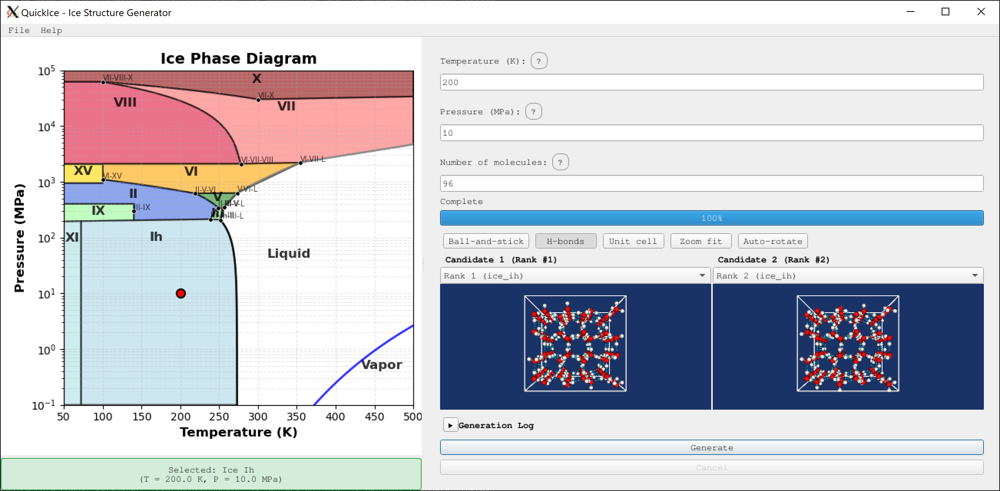

# QuickIce

> **Experimental** 
>
> - This is a "pure vibe coding project" created as a coding exercise. No physics simulations are performed. Results are plausible candidates, not validated structures.
>
> - While I (the human) attempted to review every single reference manually, please report to me for any incorrect citations that I didn't catch or critical flaws in the implemented methods.

Condition-based ice structure candidate generation from thermodynamic conditions (temperature and pressure).

## Overview

**What is QuickIce?**

QuickIce is a command-line tool with an optional GUI that generates plausible ice crystal structure candidates for given thermodynamic conditions. Given a temperature (K) and pressure (MPa), it:

1. **Identifies the ice polymorph** that would form under those conditions (Ice Ih, Ice Ic, Ice II, III, V, VI, VII, or VIII)
2. **Generates candidate structures** using GenIce2 with appropriate lattice parameters
3. **Ranks candidates** by energy estimate, density match, and structural diversity
4. **Constructs ice-water interfaces** — slab, pocket, or piece geometries (v3.0)
5. **Outputs PDB files** and a phase diagram visualization

**Why QuickIce?**

Ice exhibits at least 19 different crystalline phases depending on temperature and pressure. QuickIce provides a quick way to:

- Generate initial structure candidates for molecular dynamics simulations
- Explore which ice polymorphs form under specific conditions
- Visualize the ice phase diagram with your conditions marked
- Produce starting structures for further refinement

**How it works:**

QuickIce uses:
- **IAPWS-95 validated melting curves** for high-confidence phase boundaries
- **Triple point data** for solid-solid phase transitions
- **GenIce2** for structure generation with proper hydrogen bonding networks
- **Knowledge-based ranking** based on lattice energy estimates and density matching

## Installation

### System Requirements

**Linux:**
- GLIBC 2.28 or higher (Ubuntu 20.04+, Debian 10+, Rocky/RHEL 8+)
- 64-bit architecture
- OpenGL support for 3D visualization

**Note:** The GUI requires Qt 6.10.2, which needs GLIBC 2.28+ on Linux. Older distributions (Ubuntu 18.04, Mint 19.1, CentOS 7) are not supported. 

### Prerequisites

- Conda (Miniconda or Anaconda)

### One-Time Setup

```bash
# Create conda environment (includes v3.0 GUI dependencies)
conda env create -f envronment.yml
```

### Setup Environment

```bash
# For each new shell - setup.sh activates conda and exports PYTHONPATH
source setup.sh
```

### Verify Installation

```bash
python quickice.py --help
```

### GUI Usage

QuickIce v3.0 includes an optional GUI application with ice-water interface construction. To launch:

```bash
python -m quickice.gui
```

For detailed GUI documentation, see [docs/gui-guide.md](docs/gui-guide.md).


*QuickIce GUI showing ice generation and interface construction tabs*

For the usage of the binary distribution, see [README_bin.md](README_bin.md).

## Quick Start

### Basic Usage

Generate ice structures for 250K at 100 MPa with 128 water molecules:

```bash
python quickice.py --temperature 250 --pressure 100 --nmolecules 128
```

### Output

The tool will:

1. Identify the ice phase (e.g., Ice Ih at these conditions)
2. Generate 10 candidate structures
3. Rank them by combined score
4. Output PDB files to the `output/` directory
5. Generate a phase diagram PNG showing the input conditions

Example output:

Terminal STDOUT:
```
QuickIce - Ice structure generation

Temperature: 273.0K
Pressure: 0.1 MPa
Molecules: 216

Phase: Ice Ih (ice_ih)
Density: 0.9167 g/cm³

Generated 10 candidates
Note: Actual molecule count (432) differs from requested (216)
      This ensures valid crystal structure symmetry.

Ranked 10 candidates

Ranking scores (lower combined = better):
----------------------------------------------------------------------
Rank  Energy      Density     Diversity   Combined    
----------------------------------------------------------------------
1     0.0813      0.0008      1.0000      1.0000      
2     0.0815      0.0008      1.0000      1.0956      
3     0.0816      0.0008      1.0000      1.1764      
4     0.0817      0.0008      1.0000      1.2007      
5     0.0817      0.0008      1.0000      1.2073      
----------------------------------------------------------------------

Exported GROMACS files:
  - ice_ih_1.gro
  - ice_ih_2.gro
  - ice_ih_3.gro
  - ice_ih_4.gro
  - ice_ih_5.gro
  - ice_ih_6.gro
  - ... and 6 more
  Directory: sample_output

Output:
  PDB files: 10
  Directory: sample_output
    - ice_candidate_01.pdb
    - ice_candidate_02.pdb
    - ice_candidate_03.pdb
    - ... and 7 more
  Phase diagram: sample_output/phase_diagram.png

Validation:
  Valid structures: 10/10
```

See [sample_output](sample_output) for files generated with this example (ice Ih at 273K and 1atm).


### CLI Options

| Option | Short | Required | Description |
|--------|-------|----------|-------------|
| `--temperature` | `-T` | Yes | Temperature in Kelvin (0-500K) |
| `--pressure` | `-P` | Yes | Pressure in MPa (0-10000 MPa) |
| `--nmolecules` | `-N` | Yes | Number of water molecules (4-100000) |
| `--output` | `-o` | No | Output directory (default: `output`) |
| `--gromacs` | `-g` | No | Export GROMACS format (.gro, .top, .itp) |
| `--candidate` | `-c` | No | Export specific candidate rank (with `-g`) |
| `--no-diagram` | | No | Disable phase diagram generation |
| `--version` | `-V` | No | Show version number |
| `--help` | `-h` | No | Show help message |

### More Examples

Generate Ice VII structures at high pressure:

```bash
python quickice.py -T 300 -P 2500 -N 256 -o ice_vii_output
```

Generate Ice Ic (cubic ice) at low temperature:

```bash
python quickice.py -T 150 -P 0.1 -N 100
```

Generate structures without phase diagram:

```bash
python quickice.py -T 200 -P 500 -N 128 --no-diagram
```

## Supported Ice Phases

QuickIce supports 8 ice polymorphs (those with GenIce2 lattice implementations):

| Phase | Name | Pressure Range | Temperature Range |
|-------|------|----------------|-------------------|
| Ice Ih | Hexagonal ice | 0 - ~200 MPa | 0-273K |
| Ice Ic | Cubic ice | Low pressure | < 150K |
| Ice II | Rhombohedral | ~200-600 MPa | < 250K |
| Ice III | Tetragonal | ~200-400 MPa | 250-260K |
| Ice V | Monoclinic | ~400-600 MPa | 250-270K |
| Ice VI | Tetragonal | ~600-2000 MPa | 250-350K |
| Ice VII | Cubic | > 2000 MPa | 273-350K |
| Ice VIII | Ordered VII | > 2000 MPa | < 273K |

**Note:** These are approximate ranges. Phase boundaries depend on both T and P simultaneously.

**Not supported:** Ice IX, Ice X, Ice XI, Ice XV, and liquid water (no GenIce2 lattices available).

## GROMACS Export

QuickIce can export ice structures as GROMACS input files for molecular dynamics simulations.

### Exported Files

When exporting with `--gromacs`:
- **`.gro` files** — One per candidate (coordinates differ): `ice_ih_1.gro`, `ice_ih_2.gro`, etc.
- **`.top` file** — Single file (topology identical for all): `ice_ih.top`
- **`.itp` file** — Single file (force field identical for all): `tip4p_ice.itp`

This avoids duplicate top/itp files since all candidates use the same TIP4P-ICE water model.

### CLI Usage

```bash
# Export all 10 candidates (10 .gro files + 1 .top + 1 .itp)
python quickice.py -T 250 -P 100 -N 128 --gromacs --output ice_gro

# Export specific ranked candidate (1 .gro + 1 .top + 1 .itp)
python quickice.py -T 250 -P 100 -N 128 --gromacs --candidate 2
```

The `--gromacs` flag enables GROMACS format output. Use `--candidate N` to select which ranked candidate to export (1-based, default: exports all candidates).

### GUI Usage

1. Generate structures normally (enter T, P, N and click Generate)
2. Menu → **File → Export for GROMACS** (Ctrl+G)
3. Select candidate from the dropdown (left viewport selection to choose the one exported for gromacs)
4. Files are saved to the output directory

### Interface GROMACS Export (Tab 2)

1. Generate ice candidates in Tab 1 first
2. Switch to Interface Construction tab (Tab 2)
3. Select mode (Slab/Pocket/Piece), configure parameters, click Generate Interface
4. **File → Export Interface for GROMACS** (Ctrl+I)

### Water Model: TIP4P-ICE

The TIP4P-ICE water model is optimized for ice simulations:

```
Abascal, J. L. F., Sanz, E., García Fernández, R., & Vega, C. (2005). 
A potential model for the study of ices and amorphous water: TIP4P/Ice. 
Journal of Chemical Physics, 122(23), 234511. 
DOI: https://doi.org/10.1063/1.1931662
```

Credit: itp file adapted from http://bbs.keinsci.com/forum.php?mod=viewthread&tid=32973&page=1#pid222346

### Molecule Count

The molecule count input specifies a **minimum** number of molecules. GenIce2 creates supercells to satisfy space group symmetry, so the actual count may be higher. For example, requesting 216 molecules might produce 432 (2× supercell) depending on the ice phase.

## Documentation

For more details, see:

- **[CLI Reference](docs/cli-reference.md)** - Complete command-line documentation
- **[GUI Guide](docs/gui-guide.md)** - QuickIce v3.0 graphical interface documentation
- **[Ranking Algorithm](docs/ranking.md)** - How candidates are scored and ranked
- **[Design Principles](docs/principles.md)** - Project architecture and decisions

## Known Issues

Key limitations:

- Ranking uses distance-based energy estimates, not actual force field calculations
- Some phase boundaries have limited experimental data
- High-pressure phases (> 30 GPa) have larger uncertainties
- **Only 8 ice phases supported** (Ih, Ic, II, III, V, VI, VII, VIII) — Ice IX, X, XI, XV and liquid water lack GenIce2 lattice implementations
- Only pure water ice is supported

## Project Structure

```
quickice/
├── quickice.py          # CLI entry point
├── quickice/            # Main package
│   ├── main.py          # Workflow orchestration
│   ├── cli/             # Command-line parsing
│   ├── gui/             # Graphical User Interface
│   ├── validation/      # Input validation
│   ├── phase_mapping/   # T,P → ice polymorph lookup
│   ├── structure_generation/  # GenIce2 integration
│   ├── ranking/         # Candidate scoring
├── sample_output/       # Sample CLI output directory
├── environment.yml      # Conda environment file
├── setup.sh             # Environment file to source in a new shell
└── README.md            # This file
```

## Testing

Run the test suite:

```bash
pytest
```

Run with verbose output:

```bash
pytest -v
```

## Dependencies

| Package | Purpose |
|---------|---------|
| `iapws` | IAPWS-95 validated water/ice properties |
| `numpy` | Numerical operations |
| `scipy` | Scientific computing |
| `matplotlib` | Phase diagram visualization |
| `genice2` | Ice structure generation |
| `genice-core` | GenIce core algorithms |
| `pytest` | Testing framework |

## Reference

### GenIce2
- Repository: https://github.com/genice-dev/GenIce2
- Paper: "GenIce: Hydrogen-disordered ice structures by combinatorial generation", J. Comput. Chem. 2017
- DOI: https://doi.org/10.1002/jcc.25077

### IAPWS R14-08
- Document: "Revised Release on the Pressure along the Melting and Sublimation Curves of Ordinary Water Substance"
- URL: https://www.iapws.org/relguide/MeltSub.html

### spglib
- Repository: https://github.com/atztogo/spglib
- Paper: "Spglib: a software library for crystal symmetry search", Sci. Technol. Adv. Mater., Meth. 4, 2384822 (2024)
- DOI: https://doi.org/10.1080/27660400.2024.2384822

