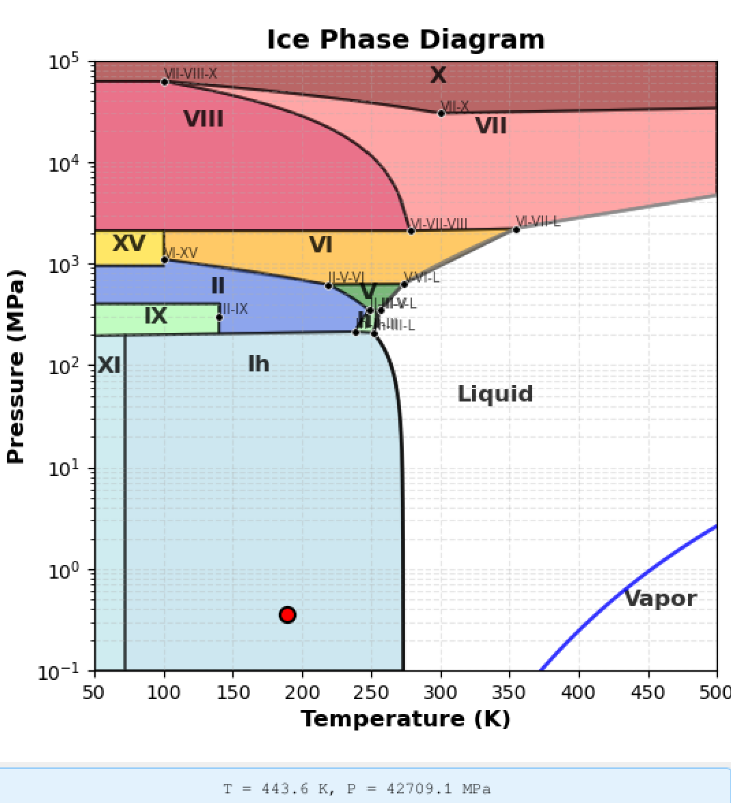
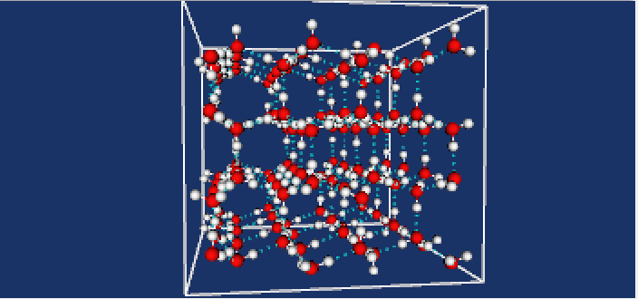
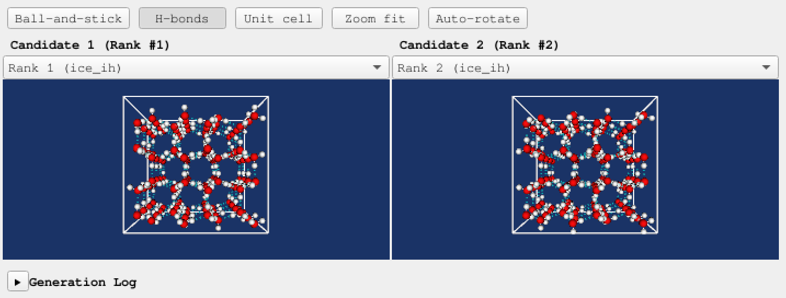
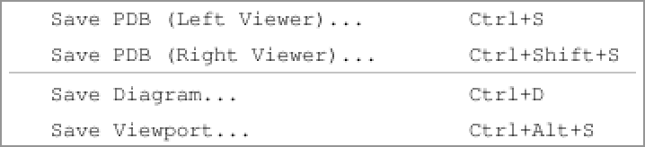

# QuickIce GUI Guide

This guide covers the QuickIce v2.0 graphical user interface.

## Overview

The QuickIce GUI provides an intuitive visual interface for:
- Interactive phase diagram selection
- Real-time 3D molecular structure visualization
- Side-by-side candidate comparison
- Multiple export formats (PDB, PNG, SVG)

## Getting Started

### Launching the GUI

```bash
python -m quickice.gui
```

<!-- TODO: Update with standalone executable instructions after Phase 12 -->

### Main Window Layout

The main window is divided into two sections:
- **Left panel**: Interactive phase diagram
- **Right panel**: Input controls, progress indicator, 3D viewer, and log output

### Basic Workflow

1. Enter temperature (K), pressure (MPa), and molecule count
2. Click on the phase diagram OR type values directly
3. Press Enter or click the Generate button
4. View ranked candidates in the dual 3D viewer
5. Export PDB files, diagram images, or viewport screenshots


*Main QuickIce GUI window with phase diagram and 3D viewer*

## Input Panel

The input panel contains three text fields for thermodynamic parameters:

### Temperature

- Range: 0-500 K
- Units: Kelvin
- Validation: Error shown if outside valid range

### Pressure

- Range: 0-10000 bar
- Units: bar (1 bar ≈ 0.1 MPa)
- Validation: Error shown if outside valid range

### Molecule Count

- Range: 4-216 molecules
- Purpose: Controls simulation cell size
- Validation: Must be integer, error shown if > 216

### Help Tooltips

Question mark icons (?) next to each field provide context-sensitive help. Hover over the icon to see additional information about each parameter.

## Interactive Phase Diagram

The left panel displays a phase diagram showing the 12 supported ice polymorphs plus liquid water and vapor regions.

### Selecting Conditions

- **Hover**: Mouse position shows live temperature and pressure coordinates
- **Click**: Click anywhere to select T,P coordinates
- **Phase detection**: Clicked region highlights the ice phase

### Input Binding

- Clicking the diagram populates the input fields with selected values
- Typing in input fields updates the marker position on the diagram
- This creates bidirectional binding between diagram and inputs

### Phase Information

Clicking on a phase region displays scientific information in the log panel:
- Phase name and structure type
- Density range
- Crystal system
- Validated references (GenIce2, IAPWS)



*Interactive phase diagram with clickable regions*

## 3D Molecular Viewer

The main viewing area displays generated ice structures in a VTK-powered 3D viewport.

### Dual Viewport Layout

After generation, two viewports show:
- **Left viewport**: Rank #1 candidate (best score)
- **Right viewport**: Rank #2 candidate (second-best score)

### Mouse Controls

- **Left-click + drag**: Rotate structure
- **Right-click + drag**: Zoom in/out
- **Middle-click + drag**: Pan view

### Representation Modes

Use the toolbar to switch between:
- **Ball-and-stick**: Spheres for atoms, cylinders for bonds (default)
- **VDW**: Van der Waals spheres (space-filling)
- **Stick**: Wireframe bonds only

### Visualization Options

- **Show H-bonds**: Toggle dashed lines for hydrogen bonds
- **Show unit cell**: Toggle wireframe box around simulation cell
- **Auto-rotate**: Toggle continuous rotation for presentations
- **Zoom to fit**: Reset camera to frame entire structure



*Single viewport showing ice structure with ball-and-stick representation*



*Dual viewport comparison of top two candidates*

## Export Options

The File menu provides multiple export formats:

### Save PDB

- **Ctrl+S**: Save PDB from left viewer (rank #1)
- **Ctrl+Shift+S**: Save PDB from right viewer (rank #2)
- Format: PDB (Protein Data Bank) with atomic coordinates
- Native file dialog with .pdb extension

### Save Diagram

- **Ctrl+D**: Export phase diagram as image
- Formats: PNG (raster) or SVG (vector)
- Includes marker at selected T,P coordinates

### Save Viewport

- **Ctrl+Alt+S**: Export 3D viewport screenshot
- Format: PNG
- Captures current view (useful for presentations)



*File menu with export options*

## Keyboard Shortcuts

| Shortcut | Action |
|----------|--------|
| Enter | Generate structures |
| Escape | Cancel generation |
| Ctrl+S | Save PDB (left viewer) |
| Ctrl+Shift+S | Save PDB (right viewer) |
| Ctrl+D | Save phase diagram |
| Ctrl+Alt+S | Save viewport screenshot |

## Help Menu

Access the **Help → Quick Reference** menu for:
- Brief application description
- Keyboard shortcuts list
- Workflow summary
- Links to GenIce2 and IAPWS resources

For scientific background, click on phase regions in the diagram to see validated references with citations.

## Troubleshooting

### "GLIBC version too old" (Linux)

The GUI requires GLIBC 2.28 or higher due to Qt 6.10.2.

**Supported Linux distributions:**
- Ubuntu 20.04 or later
- Debian 10 or later
- Rocky/RHEL 8 or later
- Fedora 30 or later

**Not supported:**
- Ubuntu 18.04, Linux Mint 19.1 (GLIBC 2.27)
- CentOS 7 (GLIBC 2.17)

**Check your GLIBC version:**
```bash
ldd --version | head -1
```

### "3D viewer unavailable in remote environment"

VTK requires local display support. If running on a remote server:
- Clone the repository to your local machine
- Run the GUI locally for full 3D visualization

In some cases, it is possible to use `QUICKICE_FORCE_VTK=true` to override the check and run the GUI remotely.

### Generation takes too long

- Reduce molecule count (try 96 instead of 216)
- High-pressure phases (Ice VII, VIII, X) are more complex

### "Failed to generate ice structure"

- Check that T,P values are within valid ranges
- Some phase boundaries have limited experimental data
- See error dialog for specific details

## Further Reading

- **[CLI Reference](cli-reference.md)** - Command-line interface documentation
- **[Ranking Algorithm](ranking.md)** - How candidates are scored
- **[GenIce2](https://github.com/genice-dev/GenIce2)** - Structure generation library
- **[IAPWS](https://www.iapws.org)** - Water/ice thermodynamic standards
