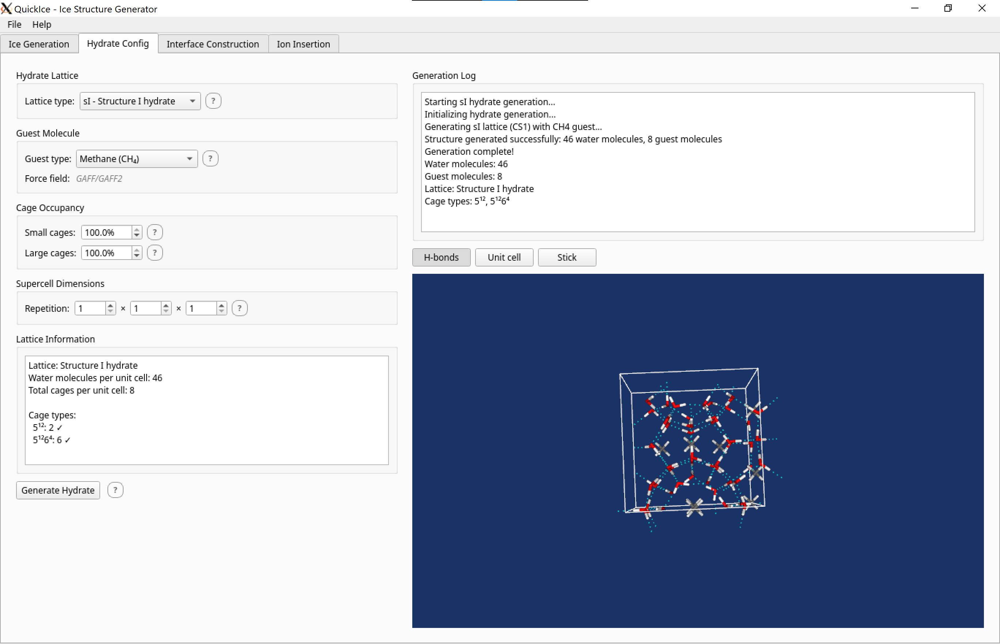
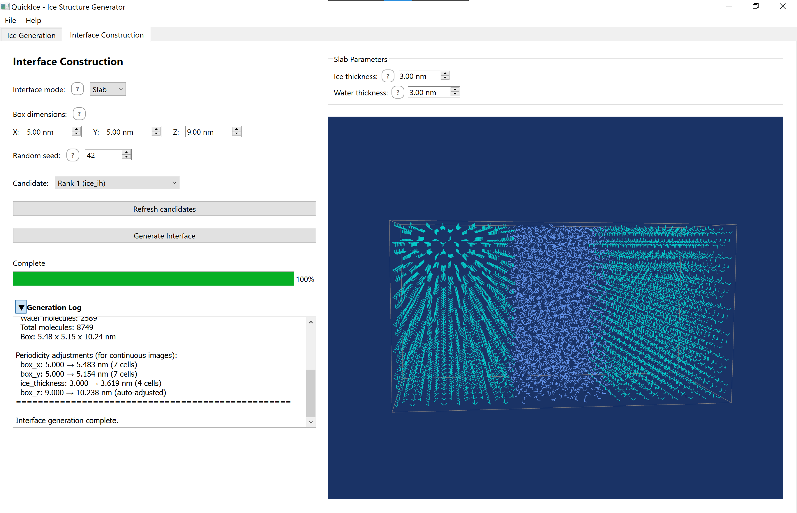
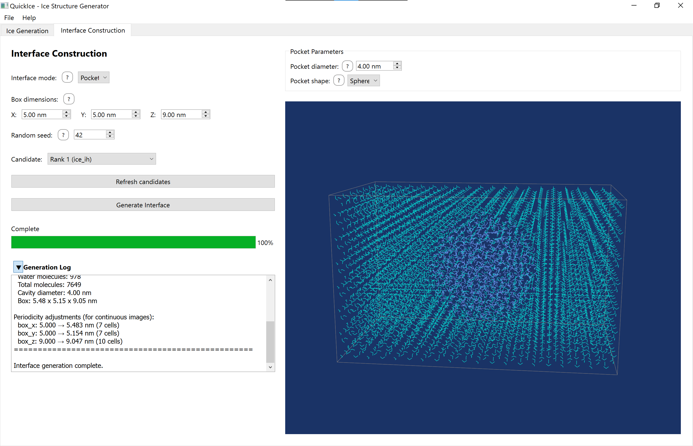
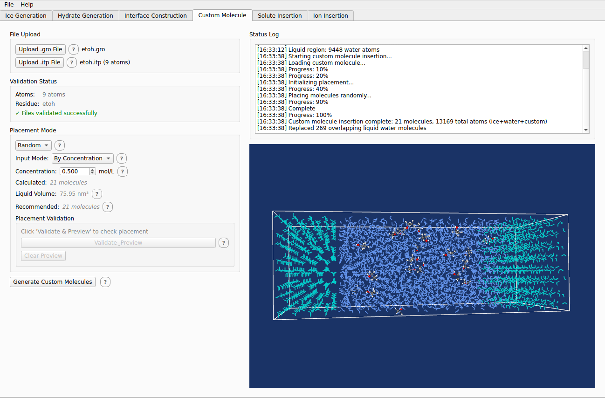
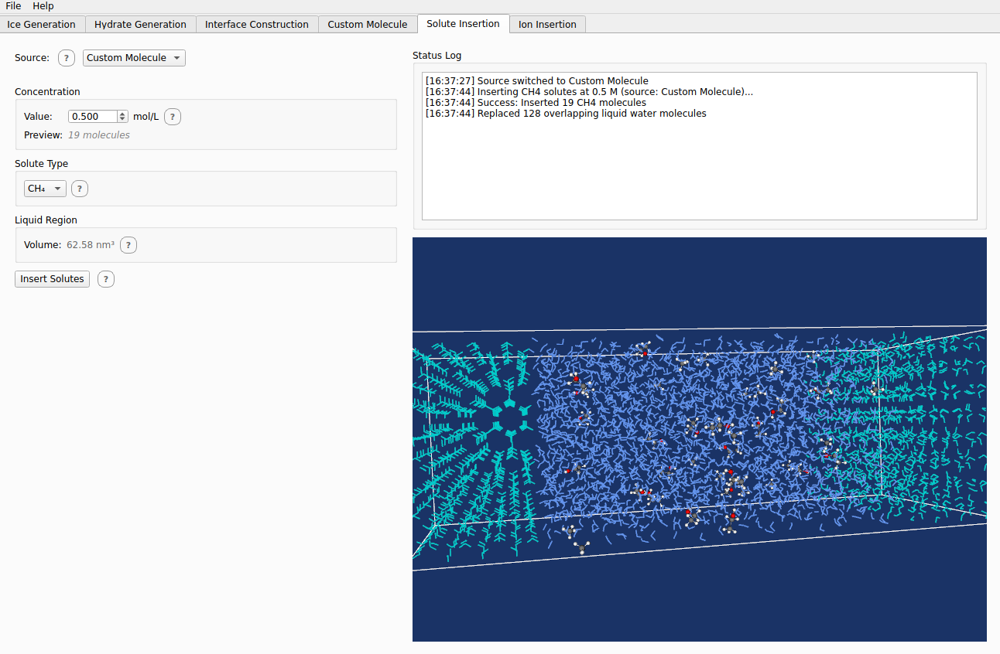
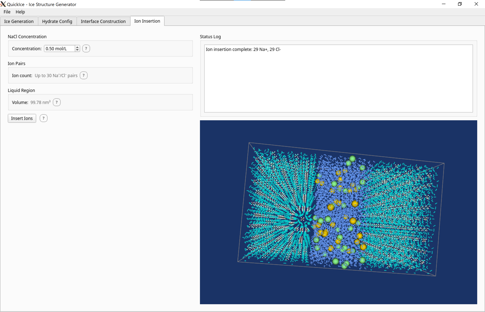

# QuickIce GUI Guide

This guide covers the QuickIce v4.5 graphical user interface.

## Overview

The QuickIce GUI provides an intuitive visual interface for:
- Interactive phase diagram selection
- Real-time 3D molecular structure visualization
- Side-by-side candidate comparison
- Multiple export formats (PDB, PNG, SVG)
- Interface Construction for ice-water systems (Tab 2)
- Custom molecule upload and insertion (Tab 3)
- Solute molecule insertion (Tab 4)

## Getting Started

### Launching the GUI

```bash
python -m quickice.gui
```

For the usage of the binary distribution, see [README_bin.md](README_bin.md).

### Main Window Layout

The main window is divided into six tabs:
- **Tab 0 (Ice Generation)**: Interactive phase diagram, input controls, and 3D viewer
- **Tab 1 (Hydrate Generation)**: Generate clathrate hydrate structures with guest molecules
- **Tab 2 (Interface Construction)**: Build ice-water interfaces for MD simulations
- **Tab 3 (Custom Molecule)**: Upload and insert custom molecules via .gro/.itp files
- **Tab 4 (Solute Insertion)**: Insert THF or CH₄ solutes into liquid water
- **Tab 5 (Ion Insertion)**: Insert NaCl ions into liquid water regions

### Basic Workflow


*QuickIce GUI v4.5 — Six-tab workflow: Ice Generation, Hydrate, Interface, Custom Molecule, Solute, and Ion tabs*
**Note:** v4.5 adds Custom Molecule (Tab 3) and Solute Insertion (Tab 4), moving Ion to Tab 5. Screenshot update pending.

1. Enter temperature (K), pressure (MPa), and molecule count
2. Click on the phase diagram OR type values directly
3. Press Enter or click the Generate button
4. View ranked candidates in the dual 3D viewer
5. Export PDB files, diagram images, or viewport screenshots


## Input Panel

The input panel contains three text fields for thermodynamic parameters:

### Temperature

- Range: 0-500 K
- Units: Kelvin
- Validation: Error shown if outside valid range

### Pressure

- Range: 0-10000 MPa
- Units: MPa (1 MPa ≈ 10 bar)
- Validation: Error shown if outside valid range

### Molecule Count

- Range: 4-216 molecules
- Purpose: Controls simulation cell size
- Validation: Must be integer, error shown if > 216

### Help Tooltips

Question mark icons (?) next to each field provide context-sensitive help. Hover over the icon to see additional information about each parameter.

## Interactive Phase Diagram


*Interactive phase diagram with clickable regions*


The left panel displays a phase diagram showing ice phase regions. QuickIce can generate structures for 8 ice polymorphs (Ih, Ic, II, III, V, VI, VII, VIII); the diagram also shows regions for Ice IX, X, XI, XV, liquid water, and vapor for reference.

### Selecting Conditions

- **Hover**: Mouse position shows live temperature and pressure coordinates
- **Click**: Click anywhere to select T,P coordinates
- **Phase detection**: Clicked region highlights the ice phase

### Input Binding

- Clicking the diagram populates the input fields with selected values
- Typing in input fields updates the marker position on the diagram
- This creates bidirectional binding between diagram and inputs

### Phase Information

Clicking on a phase region displays scientific information in the log panel:
- Phase name and structure type
- Density range
- Crystal system
- Validated references (GenIce2, IAPWS)

### Density Information

When you click on a phase region, the displayed density is calculated using IAPWS standards:

- **Ice Ih:** Temperature-dependent density from IAPWS R10-06(2009)
- **Liquid water:** Density from IAPWS-95 formulation
- **Other ice phases:** Fixed reference densities

This ensures accurate density values for interface generation and GROMACS export.

## 3D Molecular Viewer


*Single viewport showing ice structure with ball-and-stick representation*


*Dual viewport comparison of top two candidates*
The main viewing area displays generated ice structures in a VTK-powered 3D viewport.

### Dual Viewport Layout

After generation, two viewports show:
- **Left viewport**: Rank #1 candidate (best score)
- **Right viewport**: Rank #2 candidate (second-best score)

### Mouse Controls

- **Left-click + drag**: Rotate structure
- **Right-click + drag**: Zoom in/out
- **Middle-click + drag**: Pan view

### Representation Modes

Use the toolbar to switch between:
- **Ball-and-stick**: Spheres for atoms, cylinders for bonds (default)
- **VDW**: Van der Waals spheres (space-filling)
- **Stick**: Wireframe bonds only

### Visualization Options

- **Show H-bonds**: Toggle dashed lines for hydrogen bonds
- **Show unit cell**: Toggle wireframe box around simulation cell
- **Auto-rotate**: Toggle continuous rotation for presentations
- **Zoom to fit**: Reset camera to frame entire structure


## Export Options


*File menu with export options*


The File menu provides multiple export formats:

### Save PDB

- **Ctrl+S**: Save/Export from active tab (unified)
- **Ctrl+Shift+S**: Save PDB (right viewer, Tab 0 only)
- Format: PDB (Protein Data Bank) with atomic coordinates
- Native file dialog with .pdb extension

### Save Diagram

- **Ctrl+D**: Export phase diagram as image
- Formats: PNG (raster) or SVG (vector)
- Includes marker at selected T,P coordinates

### Save Viewport

- **Ctrl+Alt+S**: Export 3D viewport screenshot
- Format: PNG
- Captures current view (useful for presentations)

### Export for GROMACS

QuickIce v4.0 adds interface construction with direct GROMACS export for molecular dynamics simulations.

**Menu Path:** File → Export for GROMACS (Ctrl+G)

**Exported Files:**
- `.gro` — GROMACS coordinate file with 4-point water (O, H1, H2, MW)
- `.top` — Topology file with `[ moleculetype ]`, `[ atoms ]`, `[ bonds ]` directives
- `.itp` — Force field parameters for TIP4P-ICE water model

**Candidate Selection:**
Use the dropdown selector (left viewport) to choose which ranked candidate to export to gromacs. The selector shows "Rank N (phase)" for each available structure.

**Water Model:**
All GROMACS exports use the **TIP4P-ICE** water model, optimized for ice simulations with proper hydrogen bonding and density properties.
Credit: itp file adapted from [sklogwiki](http://www.sklogwiki.org/SklogWiki/index.php/GROMACS_topology_file_for_the_TIP4P/Ice_model) and the [computational chemistry commune](http://bbs.keinsci.com/forum.php?mod=viewthread&tid=32973&page=1#pid222346)

**Note:** The molecule count input specifies a *minimum* number of molecules. GenIce2 creates supercells to satisfy crystal symmetry requirements, so the actual molecule count may be higher. For example, requesting 216 molecules might produce 432 (a 2× supercell) depending on the ice phase.

## Keyboard Shortcuts

| Shortcut | Action |
|----------|--------|
| Enter | Generate structures |
| Escape | Cancel generation |
| Ctrl+S | Save/Export from active tab (unified) |
| Ctrl+Alt+P | Save PDB (left viewer) |
| Ctrl+Shift+S | Save PDB (right viewer, Tab 0 only) |
| Ctrl+D | Save phase diagram |
| Ctrl+Alt+S | Save viewport screenshot |
| Ctrl+G | Export ice for GROMACS (Tab 0) |
| Ctrl+H | Export hydrate for GROMACS (Tab 1) |
| Ctrl+I | Export interface for GROMACS (Tab 2) |
| Ctrl+M | Export custom molecules for GROMACS (Tab 3) |
| Ctrl+L | Export solutes for GROMACS (Tab 4) |
| Ctrl+J | Export ions for GROMACS (Tab 5) |

**Note:** Ctrl+S provides unified export from the currently active tab:
- Tab 0: Export ice structure for GROMACS
- Tab 1: Export hydrate for GROMACS
- Tab 2: Export interface for GROMACS
- Tab 3: Export custom molecules for GROMACS
- Tab 4: Export solutes for GROMACS
- Tab 5: Export ions for GROMACS

## Hydrate Generation (Tab 1)

The first tab generates clathrate hydrate structures with guest molecules using GenIce2.

### Overview

Hydrate Generation allows you to:
- Select hydrate lattice type (sI, sII, sH)
- Choose guest molecules (CH₄, THF)
- Configure cage occupancy
- Set supercell dimensions
- Export to GROMACS with bundled force field parameters

### Hydrate Panel Interface



*Screenshot of Hydrate Generation tab showing configuration controls and 3D viewer*

### Lattice Types

| Lattice | Description | Typical Guests | Cage Types |
|---------|-------------|----------------|------------|
| sI | Structure I | CH₄ | 2 small + 6 large cages |
| sII | Structure II | THF, larger guests | 16 small + 8 large cages |
| sH | Structure H | Requires helper molecule | 3 small + 2 medium + 1 large |

### Guest Molecules

| Guest | Formula | Force Field | Fits In |
|-------|---------|-------------|---------|
| CH₄ | Methane | GAFF2 | sI small cages, sII small cages |
| THF | Tetrahydrofuran | GAFF2 | sII large cages |

**GAFF2 Preparation:** Guest molecule parameters use GAFF2 with RESP2(0.5) partial charges, prepared using Multiwfn and Sobtop. Partial charge prepared using the RESP2.sh script from Multiwfn. QM calcution were done using Gaussian 16 Rev. C01. See [main README](../README.md#guest-molecules-gaff2) for full citations.

### Cage Occupancy

- **Small cages:** Occupancy percentage for small cages (0-100%)
- **Large cages:** Occupancy percentage for large cages (0-100%)
- Default: 100% (fully occupied)
- Lower values create partial occupancy for mixed-guest systems

### Supercell Dimensions

Set unit cell repetitions (nx × ny × nz):
- Higher values = larger structures
- Typical: 1-3 for testing, 3-5 for production
- Affects total molecule count and computational cost

### Workflow

1. Select lattice type (sI, sII, or sH)
2. Select guest molecule (CH₄ or THF)
3. Adjust cage occupancy if needed
4. Set supercell dimensions
5. Click "Generate Hydrate"
6. View structure in 3D viewer
7. Export for GROMACS (Ctrl+H)

### 3D Viewer

The hydrate viewer displays:
- **Water framework:** Cyan atoms with line-based bonds
- **Guest molecules:** Ball-and-stick representation
- Toggle H-bonds and unit cell visibility with toolbar buttons

### Export for GROMACS

**File → Export Hydrate for GROMACS (Ctrl+H)**

Exported files:
- `hydrate_{lattice}_{guest}_{nx}x{ny}x{nz}.gro` — Coordinates (e.g., `hydrate_sI_ch4_2x2x2.gro`)
- `hydrate_{lattice}_{guest}_{nx}x{ny}x{nz}.top` — Topology
- `ch4_hydrate.itp` or `thf_hydrate.itp` — Guest molecule parameters (GAFF2)

The water framework uses TIP4P-ICE for ice compatibility.

---

## Interface Construction (Tab 2)


The second tab builds ice-water interface structures from candidates 
generated in Tab 0. This is useful for molecular dynamics simulations 
of ice-water interfaces, confined water, or ice nucleation studies.

### Prerequisites

Generate ice candidates in Tab 0 (Ice Generation) before using Tab 2. 
The candidate dropdown in Tab 2 is populated from Tab 0's results.
Click "Refresh candidates" to sync after generating new candidates in Tab 0.

### Phase Compatibility

All supported ice phases except Ice II work with interface construction. The following phases are compatible:

- **Ice Ih, Ice Ic, Ice III, Ice VI, Ice VII, Ice VIII** — Native orthogonal cells
- **Ice V** — Monoclinic cell, automatically transformed to orthogonal for interface generation

Ice II (rhombohedral) is not supported for interface generation — it cannot form orthogonal supercells due to its rhombohedral crystal symmetry, which is incompatible with the orthogonal box requirements for interface generation. A status message appears in the interface log when transformation occurs for Ice V.

### Interface Modes

QuickIce supports three interface geometries. 

| Mode | Description | Use Case |
|------|-------------|----------|
| Slab | Layered ice-water interface | Surface melting/freezing studies |
| Pocket | Water cavity within ice matrix | Confined water studies |
| Piece | Ice crystal embedded in water | Ice nucleation/growth studies |

3D viewer displays the generated interface with phase-distinct coloring (ice=cyan, water=cornflower blue).

### Mode-Specific Parameters

#### Slab Interface



- **Ice thickness** (0.5–50 nm): Thickness of the ice layer along the Z-axis
- **Water thickness** (0.5–50 nm): Thickness of the liquid water layer
- Typical box: elongated Z-axis to accommodate both layers

#### Pocket Interface



- **Pocket diameter** (0.5–50 nm): Diameter of the spherical/cubic water cavity
- **Pocket shape**: Sphere or cubic (other shapes planned for future release.

#### Piece Interface


- No additional parameters — piece dimensions are derived from the 
  selected ice candidate
- An informational label shows the candidate dimensions automatically

### Shared Parameters

| Parameter | Range | Description |
|-----------|-------|-------------|
| Box X/Y/Z | 0.5–100 nm | Simulation box dimensions in nanometers |
| Random seed | 1–999999 | Seed for reproducible water molecule placement |

### Visualization

Tab 2 uses phase-distinct coloring to distinguish ice and water:

- **Ice phase**: Cyan atoms with line-based bonds
- **Water phase**: Cornflower blue atoms with line-based bonds
- H-bonds are hidden by default in Tab 2
- Camera defaults to Z-axis side view for slab interfaces

### Transformation Indicator

When generating interfaces with Ice V (monoclinic), you'll see a transformation message in the interface log:

```
Candidate: ice_v (384 molecules)
Transformation: Cell transformed from monoclinic to orthogonal
```

This indicates that the ice cell was automatically converted for interface generation. The transformed structure is fully compatible with GROMACS simulations.

### Export for GROMACS

**File → Export Interface for GROMACS (Ctrl+I)**

Exported files use a single combined SOL molecule type:
- `interface_{mode}.gro` — Combined ice + water coordinates
- `interface_{mode}.top` — Topology with single moleculetype SOL
- `interface_{mode}.itp` — TIP4P-ICE force field parameters

Ice molecules are normalized from 3-atom (O, H, H) to 4-atom (O, H1, H2, MW) 
TIP4P-ICE format at export time. Water molecules pass through unchanged (already 4-atom TIP4P-ICE).

## Custom Molecule Upload (Tab 3)

The third tab allows uploading and inserting custom molecules via .gro/.itp file pairs.

### Overview

Custom Molecule Upload enables you to:
- Upload user-provided .gro (coordinate) and .itp (topology) files
- Validate GRO/ITP consistency before insertion
- Choose random placement or custom position/orientation
- Insert molecules into liquid water regions with all-atom overlap checking
- Export to GROMACS with bundled custom .itp files

### Prerequisites

Generate an interface structure in Tab 2 first. Custom molecule insertion requires:
- An existing interface structure (ice + liquid water)
- Valid .gro file with atomic coordinates
- Valid .itp file with force field parameters (must include [ atomtypes ] section)

### Custom Molecule Panel Interface



*Screenshto of Custom Molecule Upload tab showing file upload controls and 3D viewer*

**Note:** Screenshot update pending for v4.5.

### GRO File Requirements

The .gro file must follow GROMACS format:

```
Custom Molecule
    8
    1CUSTOM  CA    1   1.234   2.345   3.456
    1CUSTOM  CB    2   1.456   2.567   3.678
...
   5.000   5.000   5.000
```

**Key requirements:**
- Title line (any text)
- Atom count line (must match .itp file)
- Coordinate lines with fixed-width columns:
  - Residue name (columns 6-10)
  - Atom name (columns 11-15)
  - Coordinates in nm (columns 21-45)
- Box dimensions (last line)

See the [GRO/ITP Creation Guide](gro-itp-guide.md) for detailed format specifications.

### ITP File Requirements

The .itp file must include:

```
[ atomtypes ]
; name  at.num  mass  charge  ptype  sigma  epsilon
  CA      6    12.01   0.00    A    0.355  0.29288
  
[ moleculetype ]
; name  nrexcl
CUSTOM     3

[ atoms ]
; nr  type  resnr  residue  atom  cgnr  charge  mass
   1   CA     1    CUSTOM    CA    1    0.00  12.01
```

**Required sections:**
- `[ atomtypes ]` — Force field atom types (user must provide)
- `[ moleculetype ]` — Molecule definition
- `[ atoms ]` — Atom list with types and charges

**Optional sections:**
- `[ bonds ]`, `[ angles ]`, `[ dihedrals ]` — Molecular topology

### File Validation

The system validates:
1. **Atom count match** — GRO and ITP must have same atom count
2. **Residue name consistency** — GRO residue name vs. ITP moleculetype
3. **Required sections** — ITP must have [ atomtypes ], [ moleculetype ], [ atoms ]

If validation fails, a dialog shows specific error details.

### Placement Modes

#### Random Placement (Default)

Molecules are placed randomly in liquid regions:
- All-atom overlap checking prevents clashes
- Random rotation for each molecule
- Multiple attempts until valid position found
- Status shows attempt count

**Input Mode:**

Choose how to specify the number of molecules:
- **By Count** — Enter the exact number of molecules to insert
- **By Concentration** — Enter concentration in mol/L; molecule count is calculated automatically

The system calculates molecule count from concentration using:
```
N = C_M × V_L × N_A
```
where C_M is concentration (mol/L), V_L is liquid volume (L), and N_A is Avogadro's number.

A real-time preview shows the estimated molecule count or concentration as you type.

#### Custom Placement

Specify exact position and orientation:
- **Center of mass (X, Y, Z)** — Position in nm
- **Rotation angles (α, β, γ)** — Euler angles in degrees (ZXZ convention)
- Precise control for specific configurations

**Position Management:**
- Click **Add Position** to save the current position to the list
- Select a row in the position table and click **Delete Selected** to remove it
- The position table shows: X, Y, Z, α, β, γ for each saved position

**Overlap Detection:**

When adding a position, the system checks for center-to-center overlap with existing positions (default threshold: 0.25 nm). If overlap is detected:
- A warning dialog appears: "This position overlaps with position X"
- Click **Yes** to add the position anyway (molecules may overlap)
- Click **No** to cancel and adjust the position

**Note:** Overlap checking in Custom mode is position-based (center-to-center distance), not all-atom overlap checking. For precise collision avoidance, use the "Validate & Preview" button before insertion.

### Validation & Preview (Phase 34.5)

Before bulk insertion, use the **"Validate & Preview"** button (available in Custom mode) to:

- Validate a single molecule against the interface structure
- See a semi-transparent preview of the proposed position
- View liquid region bounds (Custom mode)
- Check placement validity before committing

The validation performs bounds checking and overlap detection without modifying the structure. The preview shows the molecule in context with existing ice/water using semi-transparent rendering (opacity 0.6).

**Note:** Validation is only meaningful for Custom mode with user-specified positions. Random mode performs automatic overlap checking during insertion.

### Multi-Tab Workflow Chains

The Custom Molecule tab supports two workflow paths:

1. **Custom → Solute → Ion** (full workflow)
   - Insert custom molecules in Tab 3
   - Add solutes in Tab 4 (select "Custom Molecule" as source)
   - Add ions in Tab 5
   - Export complete system from any tab

2. **Custom → Ion** (direct workflow)
   - Insert custom molecules in Tab 3
   - Skip Tab 4, add ions directly in Tab 5
   - Export complete system

**Complete System Export:** Tab 3 exports ice + water + custom molecules (not just custom molecules). This enables the Custom Molecule result to serve as input for subsequent tabs.

### Workflow

1. Generate interface in Tab 2 first
2. Switch to Custom Molecule Upload tab (Tab 3)
3. Upload .gro file using "Upload GRO" button
4. Upload .itp file using "Upload ITP" button
5. Review validation status (green checkmark = valid)
6. Choose placement mode (Random or Custom)
7. If Custom: Enter position and rotation angles
8. (Optional) Click "Validate & Preview" to check placement
9. Click "Insert Molecule"
10. View molecule in 3D viewer (distinct colors: purple, cyan, yellow)
11. Export for GROMACS (Ctrl+S)

### 3D Viewer

The custom molecule viewer displays:
- **Custom molecules:** Ball-and-stick with distinct colors (purple, cyan, yellow)
- Multiple custom molecules shown in different colors
- Existing ice/water structure in background

### GROMACS Export

**File → Export Custom Molecules for GROMACS (Ctrl+S)**

Exported files:
- `interface_with_custom.gro` — Coordinates with custom molecules
- `interface_with_custom.top` — Topology with custom moleculetype
- `custom_molecule.itp` — Your provided .itp file (bundled to output)

Custom molecules appear after SOL in the [ molecules ] section with names like `CUSTOM_MOL_1`.

---

## Solute Insertion (Tab 4)

The fourth tab inserts THF or CH₄ solute molecules into liquid water at specified concentrations.

### Overview

Solute Insertion enables you to:
- Select THF or CH₄ as solute type
- Set concentration in mol/L (M)
- Calculate molecule count from concentration
- Insert solutes into liquid phase only
- Export to GROMACS with bundled force field parameters

### Prerequisites

Generate an interface structure in Tab 2 first. Solute insertion requires:
- An existing interface structure (ice + liquid water)
- Liquid volume > 0 for solute placement

### Solute Panel Interface



*Screenshot of Solute Insertion tab showing configuration controls and 3D viewer*

**Note:** Screenshot update pending for v4.5.

### Solute Types

| Solute | Formula | Force Field | Description |
|--------|---------|-------------|-------------|
| THF | Tetrahydrofuran | GAFF2 | 5-membered ring, common solute |
| CH₄ | Methane | GAFF2 | Small hydrophobic molecule |

Both solutes use GAFF2 parameters with RESP2(0.5) partial charges.

### Concentration Input

- **Solute concentration:** Target concentration in mol/L (M)
- Range: 0.0 - 2.0 M
- Typical values:
  - Dilute solution: 0.1 - 0.5 M
  - Concentrated solution: 1.0 - 2.0 M

### Molecule Count Calculation

The system automatically calculates solute count:

```
N_solute = concentration (mol/L) × volume (nm³) × 10⁻²⁴ × N_A
```

**Example:**
- Concentration: 0.5 M
- Liquid volume: 10 nm³
- Calculation: 0.5 × 10 × 10⁻²⁴ × 6.022×10²³ = 3.01 molecules
- Result: 3 solute molecules

The calculation:
1. Converts volume from nm³ to L (× 10⁻²⁴)
2. Multiplies by concentration to get moles
3. Multiplies by Avogadro's number to get molecule count
4. Rounds down to integer

### Source Selection (Phase 34.6)

The **Source dropdown** determines the base structure for solute insertion:

- **Interface:** Use the interface from Tab 2 (ice + liquid water)
- **Custom Molecule:** Use the complete system from Tab 3 (ice + water + custom molecules)

This enables the **Custom → Solute → Ion** workflow chain. When you select "Custom Molecule" as source, the system uses the complete structure (ice + water + custom molecules) as the base for solute insertion.

### Workflow

1. Generate interface in Tab 2 first
2. (Optional) Add custom molecules in Tab 3 for Custom → Solute workflow
3. Switch to Solute Insertion tab (Tab 4)
4. Select source: Interface or Custom Molecule
5. Select solute type (THF or CH₄)
6. Set concentration
7. Preview molecule count (updates in real-time)
8. Click "Insert Solutes"
9. View solutes in 3D viewer (ball-and-stick rendering)
10. Export for GROMACS (Ctrl+S)

### 3D Viewer

The solute viewer displays:
- **THF/CH₄ molecules:** Ball-and-stick with CPK coloring (C=cyan, H=white, O=red)
- All-atom overlap checking prevents clashes
- Existing ice/water structure in background

### Placement Algorithm

Solute molecules are placed:
1. Randomly in liquid regions (not ice)
2. With random rotation
3. Using all-atom overlap checking (not center-of-mass)
4. Multiple attempts until valid positions found
5. Respecting minimum separation distance

### GROMACS Export

**File → Export Solutes for GROMACS (Ctrl+S)**

Exported files:
- `solute_{type}_{count}molecules.gro` — Coordinates with solutes (e.g., `solute_ch4_45molecules.gro`)
- `solute_{type}_{count}molecules.top` — Topology with solute moleculetype
- `ch4_liquid.itp` or `thf_liquid.itp` — Solute force field parameters

Solute molecules appear after SOL in the [ molecules ] section with names `CH4_L` or `THF_L`.

**Note:** Solute ITP files use `_L` suffix to distinguish from hydrate guests (`CH4_H`, `THF_H`), allowing both to coexist in simulations.

---

## Ion Insertion (Tab 5)

The fifth tab inserts NaCl ions into liquid water regions of interface structures.

### Prerequisites

Generate an interface structure in Tab 2 first. Ion insertion requires:
- An existing interface structure (ice + liquid water)
- Liquid volume > 0 for ion placement

### Source Selection (Phase 34.1)

The **Source dropdown** determines the base structure for ion insertion:

- **Interface:** Use the interface from Tab 2 (ice + liquid water)
- **Custom Molecule:** Use the complete system from Tab 3 (ice + water + custom molecules)
- **Solute:** Use the complete system from Tab 4 (ice + water + solutes)

This enables the full **Custom → Solute → Ion** workflow chain. When you select "Custom Molecule" or "Solute" as source, the system uses the complete structure from that tab as the base for ion insertion.

**Charge Warning:** If the source structure contains custom molecules with non-neutral charge, a warning is displayed. The ion insertion system always generates equal Na⁺/Cl⁻ counts (charge neutral), but the overall system may remain non-neutral if custom molecules have non-zero total charge.

### Ion Panel Interface



*Screenshot of Ion Insertion tab showing configuration controls and 3D viewer*

**Note:** Screenshot update pending for v4.5.

### Concentration Input

- **NaCl concentration:** Target concentration in mol/L (M)
- Range: 0.0 - 5.0 M
- Typical seawater: ~0.6 M
- Drinking water: <0.05 M

### Ion Count Calculation

The system automatically calculates ion pairs based on:
```
N_pairs = concentration (mol/L) × volume (nm³) × 10⁻²⁴ × N_A
```

The ion count calculation:
1. Converts volume from nm³ to L (× 10⁻²⁴)
2. Multiplies by concentration (mol/L) to get moles of ions
3. Multiplies by Avogadro's number (N_A) to get ion pairs
4. Enforces equal Na⁺/Cl⁻ counts for charge neutrality

Where N_A is Avogadro's number. The display shows "Up to N" because actual count may be lower due to:
- Limited water molecules for replacement
- Minimum 0.3 nm separation constraint
- Charge neutrality requirements

### Workflow

1. Generate interface in Tab 2 first
2. Switch to Ion Insertion tab (Tab 5)
3. Set NaCl concentration
4. Click "Insert Ions"
5. View ions in 3D viewer (Na⁺ = gold, Cl⁻ = green)
6. Export for GROMACS (Ctrl+J)

### 3D Viewer

The ion viewer displays:
- **Na⁺ ions:** Gold spheres (VDW representation)
- **Cl⁻ ions:** Green spheres (VDW representation)
- Existing ice/water structure shown in background

### Charge Neutrality

The system enforces charge neutrality:
- Equal Na⁺ and Cl⁻ counts
- Ions replace water molecules in liquid region (not ice)
- Madrid2019 force field parameters used (Na⁺ charge = +0.85, Cl⁻ charge = -0.85) — Zeron, Abascal, & Vega, J. Chem. Phys. 151, 134504 (2019), DOI: https://doi.org/10.1063/1.5121392

### Export for GROMACS

**File → Export Ions for GROMACS (Ctrl+J)**

Exported files:
- `interface_with_ions.gro` — Coordinates with ions
- `interface_with_ions.top` — Topology with Na⁺/Cl⁻
- `ion.itp` — Madrid2019 ion parameters

The water model remains TIP4P-ICE for compatibility with ice simulations.

---

## Help Menu

Access the **Help → Quick Reference** menu for:
- Brief application description
- Keyboard shortcuts list
- Workflow summary
- Links to GenIce2 and IAPWS resources

For scientific background, click on phase regions in the diagram to see validated references with citations.

## Troubleshooting

### "GLIBC version too old" (Linux)

The GUI requires GLIBC 2.28 or higher due to Qt 6.10.2.

**Supported Linux distributions:**
- Ubuntu 20.04 or later
- Debian 10 or later
- Rocky/RHEL 8 or later
- Fedora 30 or later

**Not supported:**
- Ubuntu 18.04, Linux Mint 19.1 (GLIBC 2.27)
- CentOS 7 (GLIBC 2.17)

**Check your GLIBC version:**
```bash
ldd --version | head -1
```

### "3D viewer unavailable in remote environment"

VTK requires local display support. If running on a remote server:
- Clone the repository to your local machine
- Run the GUI locally for full 3D visualization

In some cases, it is possible to use `QUICKICE_FORCE_VTK=true` to override the check and run the GUI remotely.

### Generation takes too long

- Reduce molecule count (try 96 instead of 216)
- High-pressure phases (Ice VII, VIII, X) are more complex

### "Failed to generate ice structure"

- Check that T,P values are within valid ranges
- Some phase boundaries have limited experimental data
- See error dialog for specific details

## Further Reading

- **[CLI Reference](cli-reference.md)** - Command-line interface documentation
- **[Ranking Algorithm](ranking.md)** - How candidates are scored
- **[GenIce2](https://github.com/genice-dev/GenIce2)** - Structure generation library
- **[IAPWS](https://www.iapws.org)** - Water/ice thermodynamic standards
- **[TIP4P-ice Reference](https://doi.org/10.1063/1.1931662)** - TIP4P-ice reference
