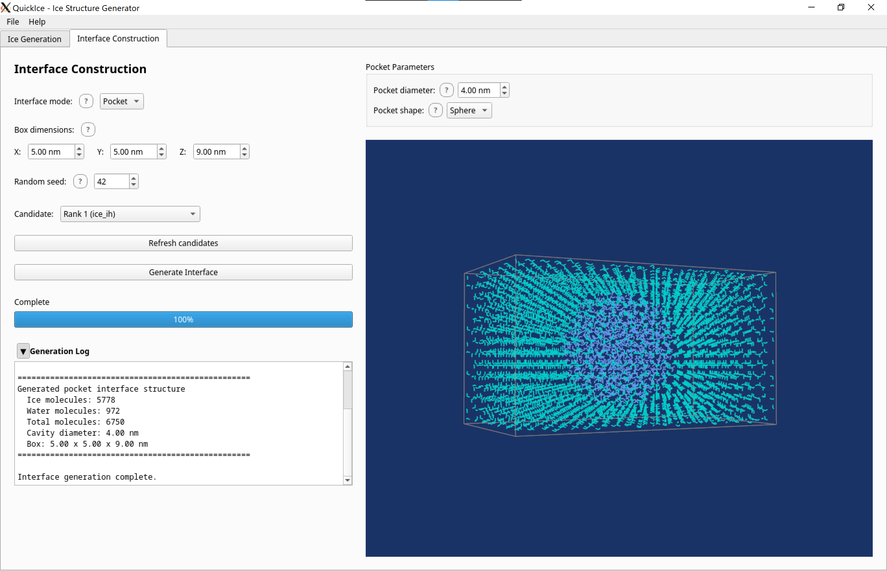
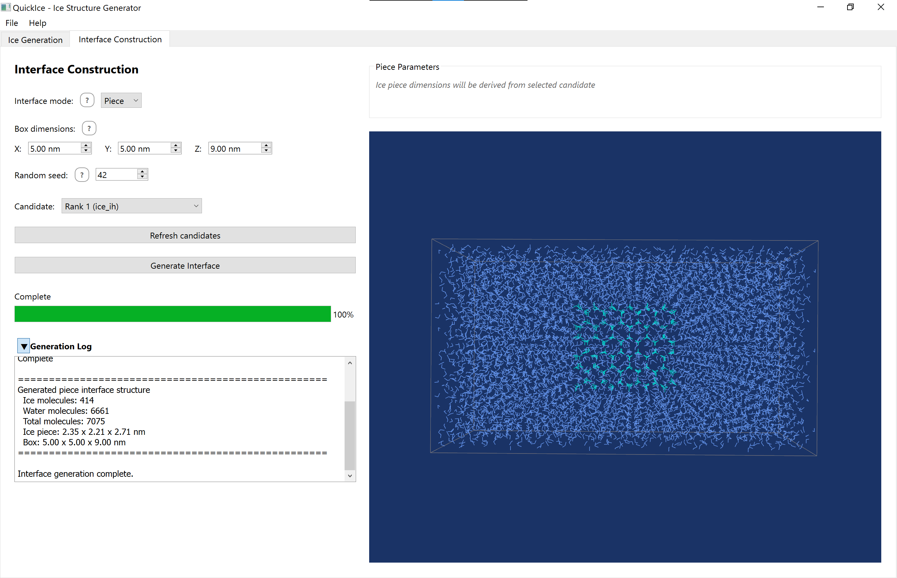

# QuickIce GUI Guide

This guide covers the QuickIce v3.0 graphical user interface.

## Overview

The QuickIce GUI provides an intuitive visual interface for:
- Interactive phase diagram selection
- Real-time 3D molecular structure visualization
- Side-by-side candidate comparison
- Multiple export formats (PDB, PNG, SVG)
- Interface Construction for ice-water systems (Tab 2)

## Getting Started

### Launching the GUI

```bash
python -m quickice.gui
```

For the usage of the binary distribution, see [README_bin.md](README_bin.md).

### Main Window Layout

The main window is divided into two tabs:
- **Tab 1 (Ice Generation)**: Interactive phase diagram, input controls, and 3D viewer
- **Tab 2 (Interface Construction)**: Build ice-water interfaces for MD simulations

### Basic Workflow


*Main QuickIce GUI window with phase diagram and 3D viewer*

1. Enter temperature (K), pressure (MPa), and molecule count
2. Click on the phase diagram OR type values directly
3. Press Enter or click the Generate button
4. View ranked candidates in the dual 3D viewer
5. Export PDB files, diagram images, or viewport screenshots


## Input Panel

The input panel contains three text fields for thermodynamic parameters:

### Temperature

- Range: 0-500 K
- Units: Kelvin
- Validation: Error shown if outside valid range

### Pressure

- Range: 0-10000 bar
- Units: bar (1 bar ≈ 0.1 MPa)
- Validation: Error shown if outside valid range

### Molecule Count

- Range: 4-216 molecules
- Purpose: Controls simulation cell size
- Validation: Must be integer, error shown if > 216

### Help Tooltips

Question mark icons (?) next to each field provide context-sensitive help. Hover over the icon to see additional information about each parameter.

## Interactive Phase Diagram


*Interactive phase diagram with clickable regions*


The left panel displays a phase diagram showing ice phase regions. QuickIce can generate structures for 8 ice polymorphs (Ih, Ic, II, III, V, VI, VII, VIII); the diagram also shows regions for Ice IX, X, XI, XV, liquid water, and vapor for reference.

### Selecting Conditions

- **Hover**: Mouse position shows live temperature and pressure coordinates
- **Click**: Click anywhere to select T,P coordinates
- **Phase detection**: Clicked region highlights the ice phase

### Input Binding

- Clicking the diagram populates the input fields with selected values
- Typing in input fields updates the marker position on the diagram
- This creates bidirectional binding between diagram and inputs

### Phase Information

Clicking on a phase region displays scientific information in the log panel:
- Phase name and structure type
- Density range
- Crystal system
- Validated references (GenIce2, IAPWS)

## 3D Molecular Viewer


*Single viewport showing ice structure with ball-and-stick representation*


*Dual viewport comparison of top two candidates*
The main viewing area displays generated ice structures in a VTK-powered 3D viewport.

### Dual Viewport Layout

After generation, two viewports show:
- **Left viewport**: Rank #1 candidate (best score)
- **Right viewport**: Rank #2 candidate (second-best score)

### Mouse Controls

- **Left-click + drag**: Rotate structure
- **Right-click + drag**: Zoom in/out
- **Middle-click + drag**: Pan view

### Representation Modes

Use the toolbar to switch between:
- **Ball-and-stick**: Spheres for atoms, cylinders for bonds (default)
- **VDW**: Van der Waals spheres (space-filling)
- **Stick**: Wireframe bonds only

### Visualization Options

- **Show H-bonds**: Toggle dashed lines for hydrogen bonds
- **Show unit cell**: Toggle wireframe box around simulation cell
- **Auto-rotate**: Toggle continuous rotation for presentations
- **Zoom to fit**: Reset camera to frame entire structure


## Export Options


*File menu with export options*


The File menu provides multiple export formats:

### Save PDB

- **Ctrl+S**: Save PDB from left viewer (rank #1)
- **Ctrl+Shift+S**: Save PDB from right viewer (rank #2)
- Format: PDB (Protein Data Bank) with atomic coordinates
- Native file dialog with .pdb extension

### Save Diagram

- **Ctrl+D**: Export phase diagram as image
- Formats: PNG (raster) or SVG (vector)
- Includes marker at selected T,P coordinates

### Save Viewport

- **Ctrl+Alt+S**: Export 3D viewport screenshot
- Format: PNG
- Captures current view (useful for presentations)

### Export for GROMACS

QuickIce v3.0 adds interface construction with direct GROMACS export for molecular dynamics simulations.

**Menu Path:** File → Export for GROMACS (Ctrl+G)

**Exported Files:**
- `.gro` — GROMACS coordinate file with 4-point water (O, H1, H2, MW)
- `.top` — Topology file with `[ moleculetype ]`, `[ atoms ]`, `[ bonds ]` directives
- `.itp` — Force field parameters for TIP4P-ICE water model

**Candidate Selection:**
Use the dropdown selector (left viewport) to choose which ranked candidate to export to gromacs. The selector shows "Rank N (phase)" for each available structure.

**Water Model:**
All GROMACS exports use the **TIP4P-ICE** water model, optimized for ice simulations with proper hydrogen bonding and density properties.
Credit: itp file adapted from http://bbs.keinsci.com/forum.php?mod=viewthread&tid=32973&page=1#pid222346

**Note:** The molecule count input specifies a *minimum* number of molecules. GenIce2 creates supercells to satisfy crystal symmetry requirements, so the actual molecule count may be higher. For example, requesting 216 molecules might produce 432 (a 2× supercell) depending on the ice phase.

## Keyboard Shortcuts

| Shortcut | Action |
|----------|--------|
| Enter | Generate structures |
| Escape | Cancel generation |
| Ctrl+S | Save PDB (left viewer) |
| Ctrl+Shift+S | Save PDB (right viewer) |
| Ctrl+D | Save phase diagram |
| Ctrl+Alt+S | Save viewport screenshot |
| Ctrl+G | Export for GROMACS (Tab 1) |
| Ctrl+I | Export interface for GROMACS (Tab 2) |

## Interface Construction (Tab 2)


*Slab interface with phase-distinct coloring (ice=cyan, water=cornflower blue)*

The second tab builds ice-water interface structures from candidates 
generated in Tab 1. This is useful for molecular dynamics simulations 
of ice-water interfaces, confined water, or ice nucleation studies.

### Prerequisites

Generate ice candidates in Tab 1 (Ice Generation) before using Tab 2. 
The candidate dropdown in Tab 2 is populated from Tab 1's results.
Click "Refresh candidates" to sync after generating new candidates in Tab 1.

### Interface Modes

QuickIce supports three interface geometries:

| Mode | Description | Use Case |
|------|-------------|----------|
| Slab | Layered ice-water interface | Surface melting/freezing studies |


| Pocket | Water cavity within ice matrix | Confined water studies |



| Piece | Ice crystal embedded in water | Ice nucleation/growth studies |



### Mode-Specific Parameters

#### Slab Parameters


- **Ice thickness** (0.5–50 nm): Thickness of the ice layer along the Z-axis
- **Water thickness** (0.5–50 nm): Thickness of the liquid water layer
- Typical box: elongated Z-axis to accommodate both layers

#### Pocket Parameters


- **Pocket diameter** (0.5–50 nm): Diameter of the spherical/ellipsoidal water cavity
- **Pocket shape**: Sphere or Ellipsoid (ellipsoid support planned for future release)

#### Piece Parameters


- No additional parameters — piece dimensions are derived from the 
  selected ice candidate
- An informational label shows the candidate dimensions automatically

### Shared Parameters

| Parameter | Range | Description |
|-----------|-------|-------------|
| Box X/Y/Z | 0.5–100 nm | Simulation box dimensions in nanometers |
| Random seed | 1–999999 | Seed for reproducible water molecule placement |

### Visualization

Tab 2 uses phase-distinct coloring to distinguish ice and water:

- **Ice phase**: Cyan atoms with line-based bonds
- **Water phase**: Cornflower blue atoms with line-based bonds
- H-bonds are hidden by default in Tab 2
- Camera defaults to Z-axis side view for slab interfaces

### Export for GROMACS


**File → Export Interface for GROMACS (Ctrl+I)**

Exported files use a single combined SOL molecule type:
- `interface_{mode}.gro` — Combined ice + water coordinates
- `interface_{mode}.top` — Topology with single moleculetype SOL
- `interface_{mode}.itp` — TIP4P-ICE force field parameters

Ice molecules are normalized from 3-atom (O, H, H) to 4-atom (O, H1, H2, MW) 
TIP4P-ICE format at export time. Water molecules pass through unchanged (already 4-atom TIP4P-ICE).

## Help Menu

Access the **Help → Quick Reference** menu for:
- Brief application description
- Keyboard shortcuts list
- Workflow summary
- Links to GenIce2 and IAPWS resources

For scientific background, click on phase regions in the diagram to see validated references with citations.

## Troubleshooting

### "GLIBC version too old" (Linux)

The GUI requires GLIBC 2.28 or higher due to Qt 6.10.2.

**Supported Linux distributions:**
- Ubuntu 20.04 or later
- Debian 10 or later
- Rocky/RHEL 8 or later
- Fedora 30 or later

**Not supported:**
- Ubuntu 18.04, Linux Mint 19.1 (GLIBC 2.27)
- CentOS 7 (GLIBC 2.17)

**Check your GLIBC version:**
```bash
ldd --version | head -1
```

### "3D viewer unavailable in remote environment"

VTK requires local display support. If running on a remote server:
- Clone the repository to your local machine
- Run the GUI locally for full 3D visualization

In some cases, it is possible to use `QUICKICE_FORCE_VTK=true` to override the check and run the GUI remotely.

### Generation takes too long

- Reduce molecule count (try 96 instead of 216)
- High-pressure phases (Ice VII, VIII, X) are more complex

### "Failed to generate ice structure"

- Check that T,P values are within valid ranges
- Some phase boundaries have limited experimental data
- See error dialog for specific details

## Further Reading

- **[CLI Reference](cli-reference.md)** - Command-line interface documentation
- **[Ranking Algorithm](ranking.md)** - How candidates are scored
- **[GenIce2](https://github.com/genice-dev/GenIce2)** - Structure generation library
- **[IAPWS](https://www.iapws.org)** - Water/ice thermodynamic standards
- **[TIP4P-ice Reference](https://doi.org/10.1063/1.1931662)** - TIP4P-ice reference
